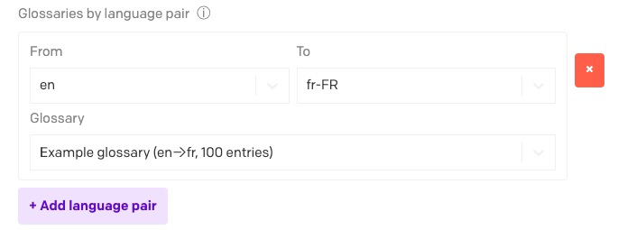

# AI Translations

This plugin integrates with AI providers and provides on-demand AI-powered translations for your fields. You can also translate entire records or perform bulk translations across multiple records and models.


## Changelog

- 3.4.0: Added better error handling for the CORS proxy and DeepL-specific configuration UI improvements. Selecting a glossary to use should be easier now.
- Prior to 3.4.0: No changelog was kept.

## Configuration

On the plugin's Settings screen:

1. **AI Vendor**: Choose your provider — OpenAI (ChatGPT), Google (Gemini), Anthropic (Claude), or DeepL.
2. If you chose OpenAI:
   - **OpenAI API Key**: Paste a valid OpenAI key.
   - **GPT Model**: After entering your key, the plugin lists available chat models. Select a model from the dropdown.
3. If you chose Google (Gemini):
   - **Google API Key**: Paste a valid key from a GCP project with the Generative Language API enabled.
   - **Gemini Model**: Select a model from the dropdown.
4. If you chose Anthropic (Claude):
   - **Anthropic API Key**: Paste a valid Anthropic key.
   - **Claude Model**: Select a model from the dropdown.
5. If you chose DeepL:
   - **DeepL API Key**: Paste your DeepL API key.
   - **Use DeepL Free endpoint**: Enable this if your key ends with `:fx` (Free plan).
6. **Prompt Template** (AI vendors only): Customize how translations are requested. Use `{fieldValue}`, `{fromLocale}`, `{toLocale}`, and `{recordContext}`.
7. **Translatable Field Types**: Pick which field editor types (single_line, markdown, structured_text, etc.) can be translated.
8. **Translate Whole Record**: Enable the sidebar that translates every localized field in a record.
9. **Translate Bulk Records**: Enable bulk translations from table view or via the dedicated page.
10. **AI Bulk Translations Page**: Translate whole models at once.

### Key Restrictions and Security
- Keys are stored in plugin settings and used client‑side. Do not share your workspace publicly.
- Prefer restricting keys:
  - OpenAI: regular secret key; rotate periodically.
  - Google: restrict by HTTP referrer and enable only the Generative Language API.
- The plugin redacts API keys from debug logs automatically.

_**Models**_
- OpenAI: the model list is fetched dynamically for your account; the plugin filters out embeddings, audio/whisper/tts, moderation, image, and realtime models.
- Google: the model list is fetched dynamically from the Generative Language API.

Save your changes. The plugin is now ready.

## Usage

### Field-Level Translations

For each translatable field:

1. Click on the field's dropdown menu in the DatoCMS record editor (on the top right of the field)
2. Select "Translate to" -> Choose a target locale or "All locales."
3. The plugin uses your OpenAI settings to generate a translation.
4. The field updates automatically.

You can also pull content from a different locale by choosing "Translate from" to copy and translate that locale's content into your current locale.

### Whole-Record Translations

If enabled:

1. Open a record that has multiple locales.
2. The "DatoGPT Translate" panel appears in the sidebar.
3. Select source and target locales, then click "Translate Entire Record."
4. All translatable fields get updated with AI translations.

### Bulk Translations from Table View

Translate multiple records at once from any table view:

1. In the Content area, navigate to any model's table view
2. Select multiple records by checking the boxes on the left side
3. Click the three dots dropdown in the bar at the bottom (to the right of the bar)
4. Choose your source and target languages
5. The translation modal will show progress as all selected records are translated


### AI Bulk Translations Page

The plugin includes a dedicated page for translating multiple models at once:

1. Go to Settings → AI Bulk Translations (in the sidebar)
2. Select your source and target languages
3. Choose one or more models to translate (block models are excluded)
4. Click "Start Bulk Translation"
5. The modal will display progress as all records from the selected models are translated


## Contextual Translations

The plugin now supports context-aware translations through the `{recordContext}` placeholder:

- **Benefits**:
  - Better understanding of specialized terminology
  - Improved consistency across related fields
  - More accurate translations that respect the overall content meaning
  - Appropriate tone and style based on context

## ICU Message Format Support

The plugin supports **[ICU Message Format](https://unicode-org.github.io/icu/userguide/format_parse/messages/)** strings, ensuring that complex pluralization and selection logic is preserved during translation.

- **Smart Masking**: Simple variables like `{name}` are masked to protect them, while ICU structures like `{count, plural, ...}` are passed to the AI.
- **AI Instructions**: The AI is explicitly instructed to preserve the ICU structure and keywords, translating only the human-readable content inside.

**Example:**
```
You have {count, plural, one {# message} other {# messages}}
```
Becomes:
```
Você tem {count, plural, one {# mensagem} other {# mensagens}}
```

## Customizing Prompts

You can customize the translation prompt template in the plugin settings:

- Use `{fieldValue}` to represent the content to translate
- Use `{fromLocale}` and `{toLocale}` to specify languages
- Use `{recordContext}` to include the automatically generated record context

## Excluding Models or Roles

- **Models to Exclude**: You can specify model API keys that shouldn't be affected by translations.
- **Roles to Exclude**: Certain roles can be restricted from using or seeing the plugin features.

## Troubleshooting

- **Invalid API Key**: Ensure your key matches the selected vendor and has access.
- **Rate Limit/Quota**: Reduce concurrency/batch size, switch to a lighter model, or increase your vendor quota.
- **Model Not Found**: Verify the exact model id exists for your account/region and is spelled correctly.
- **Localization**: Make sure your project has at least two locales, otherwise translation actions won't appear.

## DeepL Glossaries

The plugin supports DeepL glossaries to enforce preferred terminology. You can set a default glossary ID and/or map specific language pairs to specific glossary IDs. This works for all field types, including Structured Text.

### Requirements

- A DeepL API key with access to Glossaries. Check your DeepL account/plan capabilities.
- Currently only tested against DeepL v2 glossaries. Use v3 at your own risk (https://developers.deepl.com/api-reference/glossaries/v2-vs-v3-endpoints)

### Configure DeepL Glossaries in the Plugin

1. Open the plugin settings and choose the vendor "DeepL".
2. Enter your DeepL API Key and verify it via the "Test API Key" button.
3. Expand "Glossary Settings".
4. We automatically detect glossaries available to your API key.
5. Optional: Set "Default glossary ID" (e.g., `abc123-efg456-etc`) from the available list. This will only apply to translations of this language pairing, and will be ignored otherwise.
6. Optional: Specify one or more explicit language pairings using the pairing builder: 
  

### Resolution Order

When translating from `fromLocale` → `toLocale`, the plugin picks a glossary ID using this precedence:

1. Exact pair match by your project locales (e.g., `en-US:pt-BR`).
2. Wildcard any→target (e.g.`*:pt-BR`).
3. Wildcard source→any (e.g. `en:*` or `en-US:*`).
4. Default glossary ID (if set and applicable).
5. Otherwise, no glossary is used.

If DeepL returns a glossary mismatch (e.g., glossary languages don’t match the current pair) or a missing glossary, the plugin automatically retries the same request once without a glossary so your translation continues. A brief hint is surfaced in the UI logs.

### Tips and Limitations

- Glossaries apply only to the DeepL vendor. OpenAI/Gemini/Anthropic do not use glossaries.
- The plugin preserves placeholders and HTML tags automatically (`notranslate`, `ph`, etc.). Glossaries will not alter those tokens. This behavior can be configured in the DeepL Tag Settings.
- If you set a DeepL "formality" level, it is sent only for targets that support it; otherwise omitted.
- Ensure you test the API key after entering it to catch any potential errors.

### Quick Sanity Test

1. Create a small EN→DE glossary with an obvious term (e.g., “CTA” → “Call‑to‑Action”).
2. In Settings → DeepL, paste the glossary ID into either Default or the `EN->DE=...` mapping.
3. Translate a field from EN to DE containing “CTA”. The resulting German text should include your glossary translation.

## Migration Notes

- Existing installations continue to work with OpenAI by default; your current `apiKey` and `gptModel` remain valid.
- To use Google (Gemini):
  1. In Google Cloud, enable the Generative Language API for your project.
  2. Create an API key and restrict it by HTTP referrer if possible.
  3. In the plugin settings, switch vendor to Google (Gemini), paste the key, and select a Gemini model.
- To use Anthropic (Claude):
  1. Get an API key from the Anthropic Console.
  2. In the plugin settings, switch vendor to Anthropic (Claude), paste the key, and select a Claude model.
- To use DeepL:
  1. Get an API key from your DeepL account (Pro or Free).
  2. In the plugin settings, switch vendor to DeepL and paste the key.
  3. If using a Free key (ends with `:fx`), enable "Use DeepL Free endpoint".

## License

This project is licensed under the MIT License - see the [LICENSE](LICENSE) file for details.
