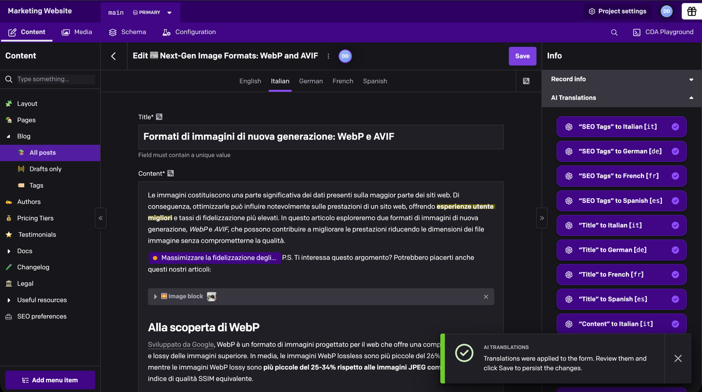
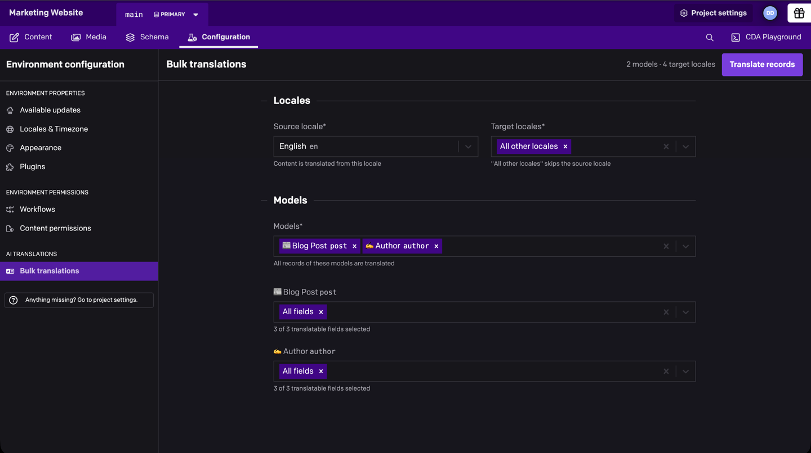

# AI Translations

Translates DatoCMS content between your project's locales with DeepL, OpenAI, Google Gemini, Anthropic Claude or Yandex Translate. You can translate a single field, a whole record, a selection of records or every record of a model.



## Setup

Your project needs at least two locales. Install **AI Translations** from **Configuration → Plugins** and let it use the current user's API token, which bulk translations need to read and save records.

In the plugin settings, pick an **AI Vendor**, enter its credentials and click **Save**:

- DeepL: an API key. For a Free-plan key, turn on **Use DeepL Free endpoint**. This happens automatically for keys ending in `:fx`.
- OpenAI: an API key, then a model.
- Google Gemini: an API key from a Google project with the Generative Language API enabled, then a model.
- Anthropic Claude: an API key, then a model.
- Yandex Translate: a service-account API key with the `yc.ai.translate.execute` scope, from an account with the `ai.translate.user` role.

DeepL is the fastest and cheapest, and what we recommend for most projects. The other three also get the record's title and short text fields as context, which helps with tone and terminology, and follow a prompt you can edit. See [docs/Providers.md](docs/Providers.md) for DeepL glossaries, the prompt and other provider options.

API keys are saved in the plugin settings and used from each editor's browser, so treat them as visible to your team. Use a dedicated key and restrict it where the provider allows, for example a Google key limited to the Generative Language API.

The settings also let you limit which field types get translated (all are on by default, including Structured Text, Modular Content, SEO and media alt text), turn off the sidebar panel or table action, and exclude models, roles or fields.

## Usage

To translate one field, open its menu and choose **Translate to** with a locale or **All locales**. **Translate from** does the reverse, filling the locale you're on from another one. To translate a whole record, use the **AI Translations** panel in the record sidebar. In both cases the translation goes into the form, so review it and click **Save**.


To translate many records, select them in a table and choose **AI Translate these records** from the **⋮** menu in the bottom bar, or open **Configuration → Bulk translations** (schema editors only) to translate every record of the models you pick. Bulk translations save each record as soon as it's translated, and when the run ends you can publish all the updated records in one click.



## Caveats

Translating into a locale overwrites whatever that locale already has in the selected fields. Fields that aren't localized are never changed.

Link fields and the records they point to are never translated. When a bulk run fills a locale for the first time, it copies the links from the source locale and flags the record with a warning, so you can check whether that locale should link elsewhere.

Translated SEO titles longer than 60 characters and descriptions longer than 160 are cut short. Yandex Translate fails on any field longer than 10,000 characters.

## Development

```sh
npm ci
npm run dev
npm test
npm run lint
npm run build
```

Release history is in the [changelog](https://github.com/datocms/plugins/blob/master/ai-translations/CHANGELOG.md).
