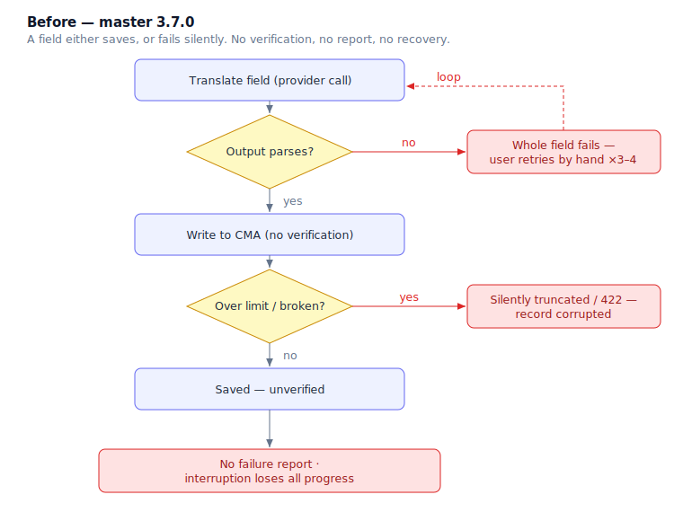
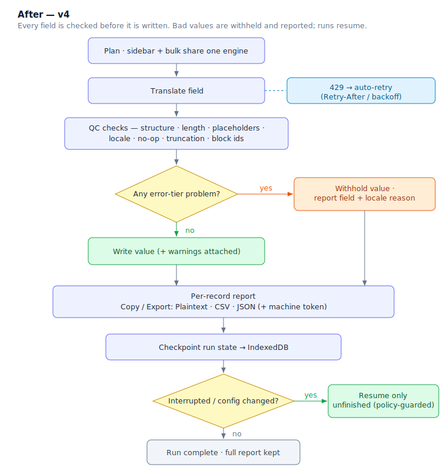

# AI Translations v4 — edge cases covered

The card asked for reliability: *"which records didn't translate properly and for what
reason"*, plus specific failure modes (single-quoted output that only translated after 3–4
tries, records silently truncated at a field's character limit, an HTML-node-count check).
This is the outline of what v4 now catches that master let through.

The pattern is uniform: **master writes whatever the provider returns and finds out later, if
at all. v4 checks every field before writing — error-tier problems are withheld and reported,
warnings are written but flagged, and the run is resumable.**

> Related: [`v4-explanation.md`](./v4-explanation.md) (why/what/how + full changelog).

---

## Before / after

| # | Edge case | master 3.7.0 | v4 |
|---|-----------|--------------|----|
| **Malformed provider output** |||
| 1 | Single-quoted JSON array (JS/Python style) | `JSON.parse` throws → field fails; only works when a retry happens to emit clean JSON (the "3–4 tries" bug) | `recoverJsonArray` normalizes quotes → parses first try |
| 2 | Trailing comma / markdown-fenced / prose-wrapped array | Same silent parse failure | Quote-aware region scan + relaxed parse recovers it |
| 3 | Provider returned N ≠ expected array elements | Multi-block field silently cropped | Positional repair + `length-mismatch` **warning** |
| 4 | Genuinely unparseable output | Silent garbage / crash | Recovery returns null → surfaced as an **error**, not written |
| **Length & truncation** |||
| 5 | Value over field's CMA `length.max` | *Silently truncated / 422 — record corrupted* (the card's example) | `length-validator` **error**, value withheld, reason reported pre-write |
| 6 | Value under `length.min` / not `eq` | 422 on save, cryptic | Caught before write, plain-language reason |
| 7 | Provider hit output-token limit (`finish_reason=length`) | Incomplete value saved silently | `truncated` **error**, withheld |
| 8 | Translation far shorter than source (script-aware; CJK-tolerant floor) | No check | `length-ratio` **warning** |
| **Structure integrity** |||
| 9 | HTML block-tag count differs — dropped heading/list/table/image (the card's ask) | No check | `html-structure` **error** |
| 10 | Markdown structure drift (headings/lists/code/links) | No check | `markdown-structure` **error** |
| 11 | Paragraph reflow / merge-split | — | `paragraph-count` **warning** only (no false failures) |
| 12 | Modular-block structure or block ids not preserved | No check | `block-structure` / `block-id-provenance` **errors** |
| 13 | Segment misalignment between source and output | No check | `segment-alignment` **error** |
| **Content fidelity** |||
| 14 | Dropped `{{placeholders}}` / ICU tokens | Silently corrupt rendered text | `placeholder-loss` **error**, withheld |
| 15 | Response came back identical to source (no translation) | Saved as-is | `no-op` **warning** (exempts URLs/numbers/short atoms) |
| 16 | Wrong target language / source leaked through | Saved as-is | `locale-preservation` **error** |
| 17 | Required field / subfield came back blank | 422 on save | `cannot-be-blank` **error**, withheld |
| 18 | Slug empty after normalization | Cryptic failure | Error with "set this slug manually for non-Latin locales" guidance |
| **Rate limits & transport** |||
| 19 | Provider 429 with `Retry-After` | Field fails, no retry | Auto-retry honoring `Retry-After` |
| 20 | 429 with header hidden (cross-origin) | Field fails | Falls back to exponential backoff |
| 21 | Systemic vs per-field error | An "unknown"-coded error could skip the pause and cascade | Normalized `{code, source, message, hint}`; systemic → pause + retry |
| **Run lifecycle** |||
| 22 | "Which records failed and why?" | No report; transient toast capped ~20 rows, gone on dismiss | Persistent modal + per-record report, Copy/Export Plaintext/CSV/JSON |
| 23 | Tab closed / crash / navigate-away mid-run | Progress lost, restart from scratch | Checkpointed to IndexedDB, detected on next visit, resumes **only unfinished units** |
| 24 | Config changed before a resume | — | Policy-digest guard refuses an incompatible resume |
| 25 | Tab close mid-run | No warning | Before-unload guard warns first |
| 26 | Per-record error surfacing | Alert rendered *behind* the modal | In-modal per-record error state (run ctx compile-barred from messaging) |
| 27 | Sidebar vs bulk behaving differently | Separate code paths | One engine — identical translate → check → conform → write |

**Tiering:** an **error** blocks that record+locale write (withheld + reported); a **warning**
is written but flagged for review. Length/byte-size heuristics are deliberately warning-only —
the same meaning takes very different lengths across scripts (per the card's note on two-byte
Asian chars vs. Latin).

---

## Flow — before

## Flow — after

