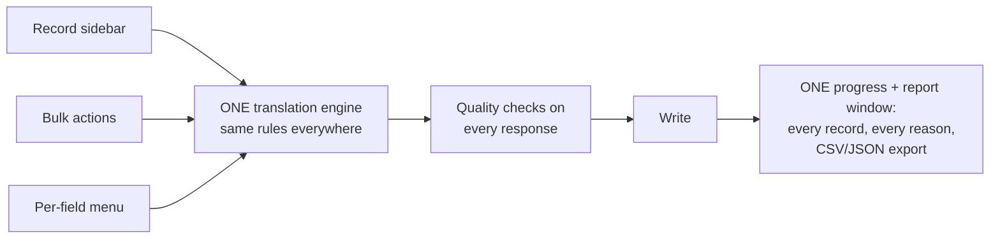
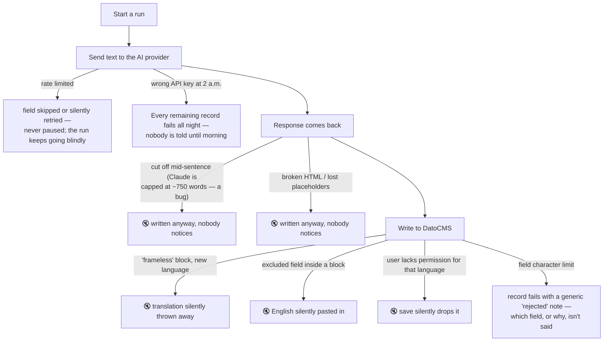
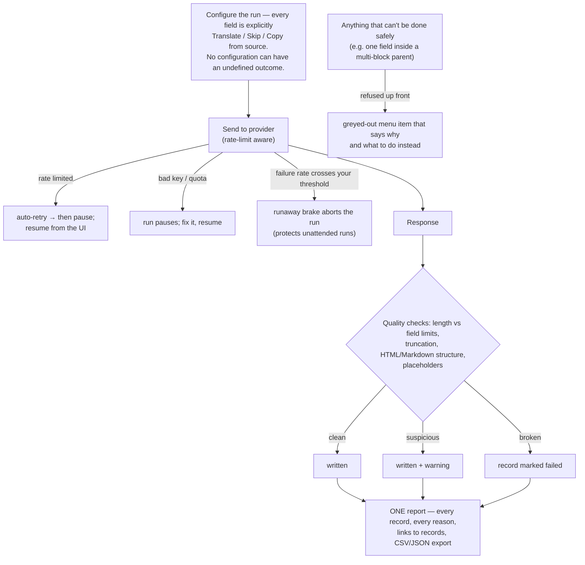
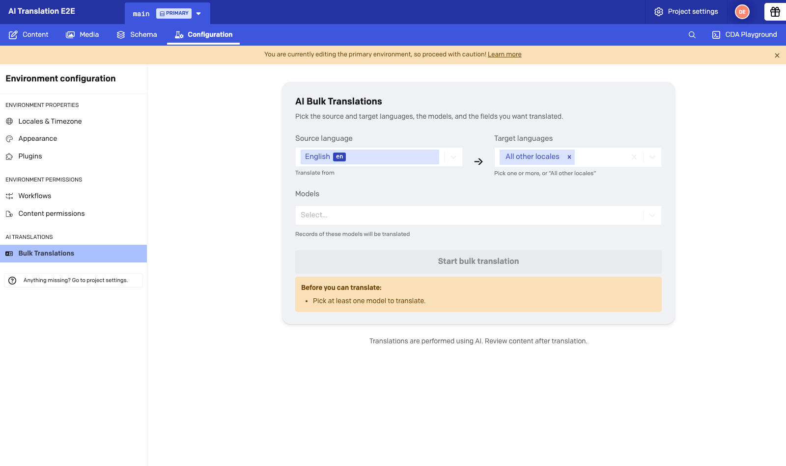
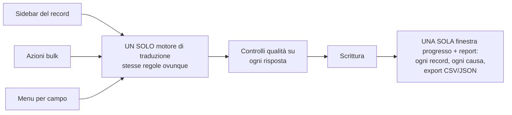
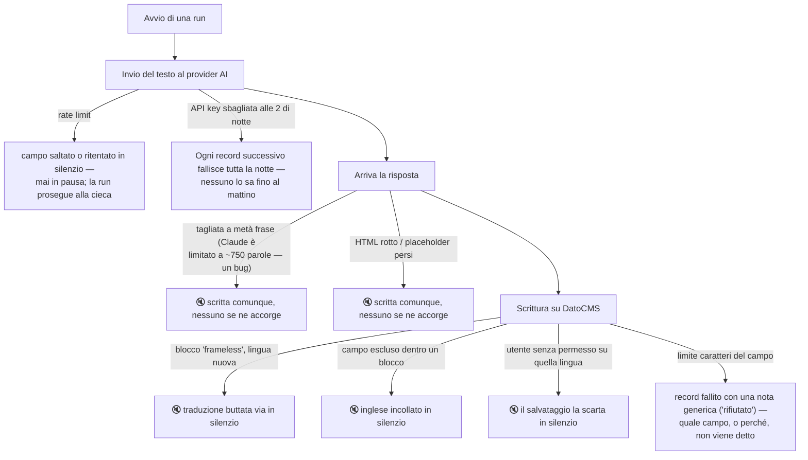
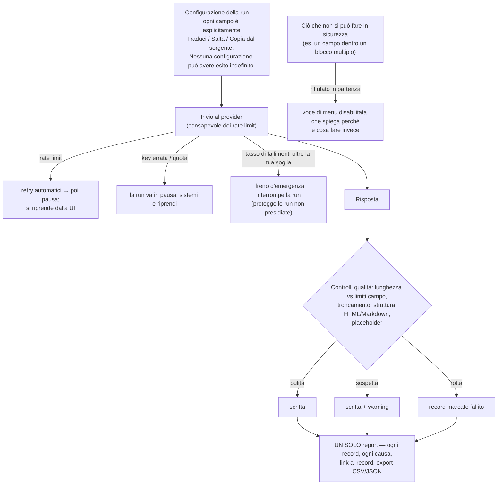

# AI Translations — what this branch does (meeting brief)

> 🇮🇹 **[Versione italiana più sotto — clicca qui](#italiano)**

**TL;DR: no big new features. We're making translation honest and predictable — one engine instead of two, explicit settings instead of magic, and when anything goes wrong: it's caught, named, and reported. By the end of this work, nothing fails silently.**

## The goal, in one picture

## Before: where things go wrong today (v3.6, live) — and what's silent

🔇 = completely silent. These aren't hypotheticals — each one comes from a real support case or a verified repro.

## After: every failure class is caught, in the UI and in the report

## Master vs this branch, side by side

| | Today (v3.6, live) | After this branch |
| --- | --- | --- |
| **Engines** | Two (single-record vs bulk) with different rules and different bugs | One engine, same behavior everywhere |
| **When output is broken** | Written as-is, silently | Checked (length, truncation, HTML/Markdown structure, placeholders); warning or failure, always visible |
| **Long fields with Claude** | Cut at ~1024 tokens (a wiring bug) | Fixed; limit correct and configurable |
| **Rate limits / bad key** | Bulk never retries (a rate-limited field is skipped with a note); the sidebar retries silently; nothing can be paused, and a bad key fails everything | Auto-retry + pause/resume in the UI (live for bulk; the sidebar gains it with the unification); runaway brake aborts a hopeless unattended run |
| **"Which records failed and why?"** | Per-record progress modal with CSV export (the first response to the support case) — but failures carry only a generic note ("DatoCMS rejected the update"), tucked behind a tooltip, and quality problems weren't detected at all | Per-record **and per-reason** report — every warning/error named; the report stays on the page after the run; CSV/JSON export; links to each record |
| **"Exclude a field" means…** | Two different things (skip at top level, paste English inside blocks) | Two explicit lists: **Exclude** (optional fields only) and **Always copy from source** (brand names, SKUs) |
| **Choosing fields/languages** | Magic "All fields" / "All other locales" pills — adding one item can silently narrow your selection to just that item | Explicit chips, an "11/11 selected" count, a Select-all button |
| **Existing target content** | Sometimes preserved, sometimes clobbered — depends on which engine you hit | One rule: translating overwrites to match the source; version history is the undo |
| **"Frameless" blocks** | Translations can vanish silently; no translate menu at all | Fixed by the unified engine; per-field translate inside single-block containers; explainer where unsafe |
| **Wrong-permission languages** | Writes silently dropped at save | Bulk writes already verified after saving; offering only the permitted languages lands with the unification |
| **Progress & report UI** | Bulk-only, two different report formats | One progress/report window for every flow; the sidebar becomes a launcher + status line |
| **Automated tests** | Unit tests only (~26 files) — nothing exercising the real dashboard or providers | Unit suite ~doubled **+** full browser E2E suite (multi-provider); today's bugs pinned as expected-failures so fixes are provable |

The "magic pill" today — one of the two selectors this work will replace with explicit chips:

## The safety net under all of this: a real test framework

The plugin had a solid **unit-test suite** (~26 test files on master; this branch roughly doubles it) — but **nothing that exercised the real dashboard, real providers, or real content**, and the silent bugs above live exactly in those seams. This branch adds the end-to-end layer:

- **Real browser, real DatoCMS, real AI providers** — no mocks (the only traffic interception is deliberate fault injection in the failure-handling tests). Playwright drives the actual dashboard and the actual plugin.
- **One isolated lane per provider** (OpenAI, Gemini, Claude, DeepL), each in its own disposable environment fork, running in parallel. Green runs clean up their forks; a failed lane keeps its sandbox for debugging and is swept later.
- **A seeded fixture project** covering every field type the plugin can touch: 12 languages, blocks, links, SEO, JSON, validators — with the tricky "frameless" block fixtures landing as part of this work.
- **Next step: today's known bugs get pinned as expected failures** — when a fix lands, the pin flips to green. The suite proves the fix, rather than us claiming it.
- **One-command manual sandbox** (`npm run test:e2e:manual`) forks a throwaway environment for hand-testing, without touching anything shared.

## This started as a support case

From the [Byway escalation](https://3.basecamp.com/5656352/buckets/33592869/card_tables/cards/10030318843): records failed silently, one was truncated by a field character limit, and there was no report saying what failed or why.

| Their ask | Status on this branch |
| --- | --- |
| "Which records didn't translate, and why?" | ✅ per-record, per-reason report + export |
| "It silently truncated a record" | ✅ length checked against field limits before saving; truncation detected |
| "Check HTML structure matches source" | ✅ HTML node-count check, error tier |
| Flaky failures needing 3–4 retries | ✅ automatic retries + pause/resume |

## Deliberately NOT doing

- No new AI features; no language detection (deferred); no "smart" block-matching of any kind — guessing is how content gets corrupted silently.
- No changes to defaults: a run configured like today behaves like today — just visibly.

**Rollout:** part of the "after" column is already built on this branch (quality checks, the report, retries, the test suite); the rest is fully specced with step-by-step implementation plans. The urgent fixes land first, the engine unification last — protected by the test suite the whole way.

---
---

# AI Translations — cosa fa questo branch (brief per la riunione)

**In breve: nessuna grande funzionalità nuova. Rendiamo la traduzione onesta e prevedibile — un solo motore invece di due, impostazioni esplicite invece di "magia", e quando qualcosa va storto: viene intercettato, nominato e riportato. Alla fine di questo lavoro, niente fallisce in silenzio.**

## L'obiettivo, in un'immagine

## Prima: dove le cose vanno storte oggi (v3.6, live) — e cosa è silenzioso

🔇 = completamente silenzioso. Non sono ipotesi — ognuno viene da un caso di supporto reale o da una riproduzione verificata.

## Dopo: ogni classe di errore viene gestita, nella UI e nel report

## Master vs questo branch, fianco a fianco

| | Oggi (v3.6, live) | Dopo questo branch |
| --- | --- | --- |
| **Motori** | Due (singolo record vs bulk), regole diverse e bug diversi | Un motore, stesso comportamento ovunque |
| **Output rotto** | Scritto così com'è, in silenzio | Controllato (lunghezza, troncamento, struttura HTML/Markdown, placeholder); warning o fallimento, sempre visibile |
| **Campi lunghi con Claude** | Tagliati a ~1024 token (bug di configurazione) | Corretto; limite giusto e configurabile |
| **Rate limit / key errata** | Il bulk non ritenta mai (un campo in rate limit viene saltato con una nota); la sidebar ritenta in silenzio; niente può andare in pausa, e una key errata fa fallire tutto | Retry automatici + pausa/ripresa nella UI (già attivi per il bulk; la sidebar li acquisisce con l'unificazione); freno d'emergenza per le run senza speranza |
| **"Quali record sono falliti e perché?"** | Modale di progresso per record con export CSV (la prima risposta al caso di supporto) — ma i fallimenti portano solo una nota generica ("DatoCMS ha rifiutato l'aggiornamento"), nascosta in un tooltip, e i problemi di qualità non venivano rilevati affatto | Report per record **e per causa** — ogni warning/errore nominato; il report resta sulla pagina dopo la run; export CSV/JSON; link a ogni record |
| **"Escludere un campo" significa…** | Due cose diverse (salta al livello alto, incolla l'inglese dentro i blocchi) | Due liste esplicite: **Escludi** (solo campi opzionali) e **Copia sempre dal sorgente** (brand, SKU) |
| **Scegliere campi/lingue** | Pillole magiche "Tutti i campi" / "Tutte le altre lingue" — aggiungere un elemento può restringere in silenzio la selezione a quel solo elemento | Chip espliciti, contatore "11/11 selezionati", pulsante Seleziona-tutto |
| **Contenuto già presente nella destinazione** | A volte preservato, a volte sovrascritto — dipende da quale motore capita | Una regola sola: tradurre sovrascrive per rispecchiare il sorgente; la cronologia versioni è l'annulla |
| **Blocchi "frameless"** | Traduzioni che spariscono in silenzio; nessun menu di traduzione | Risolto dal motore unificato; traduzione per campo nei contenitori a blocco singolo; spiegazione dove non è sicuro |
| **Lingue senza permesso** | Scritture scartate in silenzio al salvataggio | Le scritture bulk sono già verificate dopo il salvataggio; offrire solo le lingue permesse arriva con l'unificazione |
| **UI di progresso e report** | Solo bulk, due formati di report diversi | Una sola finestra progresso/report per tutti i flussi; la sidebar diventa un lanciatore + riga di stato |
| **Test automatici** | Solo unit test (~26 file) — niente che eserciti la dashboard o i provider reali | Suite unit ~raddoppiata **+** suite E2E completa nel browser (multi-provider); i bug di oggi inchiodati come fallimenti attesi, così i fix sono dimostrabili |

La "pillola magica" di oggi — uno dei due selettori che questo lavoro sostituirà con chip espliciti:

## La rete di sicurezza sotto a tutto questo: un vero framework di test

Il plugin aveva una buona **suite di unit test** (~26 file di test su master; questo branch la raddoppia circa) — ma **niente che esercitasse la dashboard reale, i provider reali o il contenuto reale**, e i bug silenziosi qui sopra vivono esattamente in quelle giunture. Questo branch aggiunge il livello end-to-end:

- **Browser vero, DatoCMS vero, provider AI veri** — niente mock (l'unica intercettazione di traffico è la fault injection deliberata nei test di gestione errori). Playwright pilota la dashboard reale e il plugin reale.
- **Una corsia isolata per provider** (OpenAI, Gemini, Claude, DeepL), ognuna nel suo fork d'ambiente usa-e-getta, in parallelo. Le run verdi puliscono i propri fork; una corsia fallita conserva la sua sandbox per il debug e viene spazzata più tardi.
- **Un progetto fixture seminato** che copre ogni tipo di campo che il plugin può toccare: 12 lingue, blocchi, link, SEO, JSON, validatori — con le fixture per gli insidiosi blocchi "frameless" in arrivo come parte di questo lavoro.
- **Prossimo passo: i bug noti di oggi vengono inchiodati come fallimenti attesi** — quando arriva il fix, il test diventa verde. È la suite a dimostrare il fix, non noi ad affermarlo.
- **Sandbox manuale con un comando** (`npm run test:e2e:manual`): forka un ambiente usa-e-getta per test a mano, senza toccare nulla di condiviso.

## Tutto è nato da un caso di supporto

Dall'[escalation di Byway](https://3.basecamp.com/5656352/buckets/33592869/card_tables/cards/10030318843): record falliti in silenzio, uno troncato dal limite caratteri di un campo, e nessun report su cosa fosse fallito né perché.

| La loro richiesta | Stato su questo branch |
| --- | --- |
| "Quali record non sono stati tradotti, e perché?" | ✅ report per record e per causa + export |
| "Ha troncato un record in silenzio" | ✅ lunghezza verificata contro i limiti del campo prima del salvataggio; troncamento rilevato |
| "Controllare che la struttura HTML corrisponda al sorgente" | ✅ controllo sul numero di nodi HTML, livello errore |
| Fallimenti intermittenti che richiedevano 3–4 tentativi | ✅ retry automatici + pausa/ripresa |

## Deliberatamente FUORI scope

- Nessuna nuova funzionalità AI; niente language detection (rimandata); nessun "block-matching intelligente" di alcun tipo — indovinare è esattamente il modo in cui il contenuto si corrompe in silenzio.
- Nessun cambiamento ai default: una run configurata come oggi si comporta come oggi — solo in modo visibile.

**Rollout:** parte della colonna "dopo" è già costruita su questo branch (controlli qualità, report, retry, suite di test); il resto è interamente specificato con piani di implementazione passo-passo. Prima arrivano i fix urgenti, per ultima l'unificazione del motore — protetta dalla suite di test lungo tutto il percorso.
