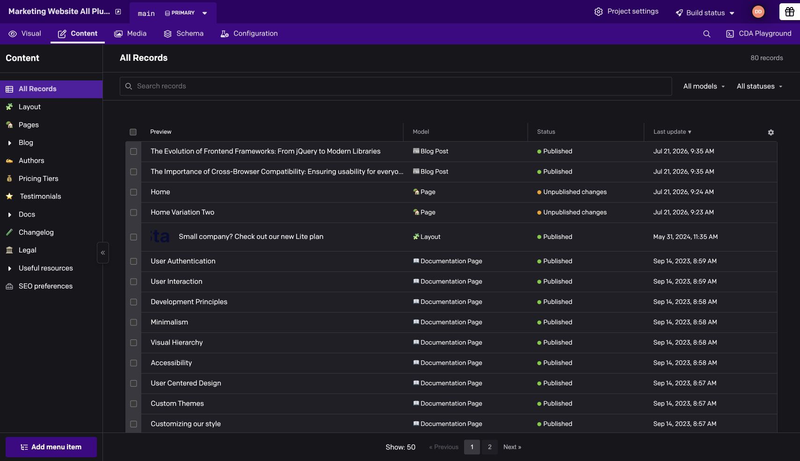
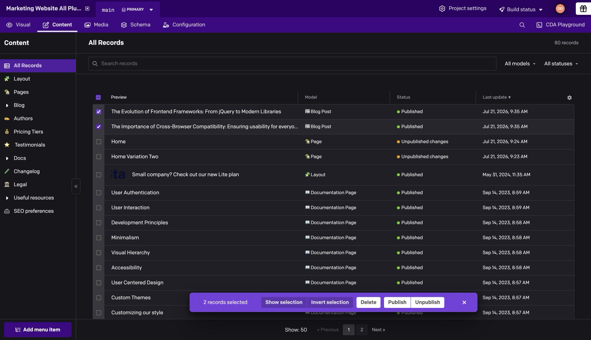

# All Records Viewer

Browse records from every model in one native-style, paginated table.

## Usage

Open **Content → All Records** to search, filter by model or status, sort columns, and choose which columns to display.

Select records to publish, unpublish, delete, or move to a workflow stage when available.

The plugin follows your existing DatoCMS permissions. Bulk actions support up to 200 eligible records at a time.
