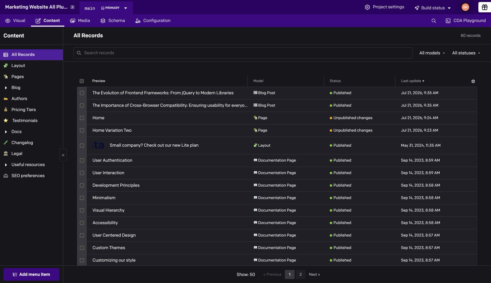
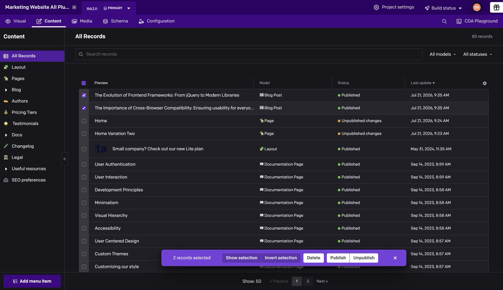

# All Records Viewer

Browse records from every model in one paginated table.

## Usage

Open **Content → All Records** to search, filter by model or status, sort columns, and choose which columns to display.

Select records to publish, unpublish, delete, or move to a workflow stage when available.

## Large projects

Selections larger than 200 records run continuously in sequential API batches of up to 200. For selections spanning multiple pages, **Select all matching records** collects the current filter's results with progress. **Show selection** uses the existing page size instead of rendering the entire selection.

Changing filters keeps the existing selection. **Select all matching records** replaces that selection with the current filter's records.

Large operations show completed, successful, and failed counts. **Cancel remaining** stops future submissions after the accepted batch finishes. Failed or unconfirmed batches remain selected; check their current state before submitting another action. The API provides counts rather than guaranteed per-record results, so a partially failed batch may include records that already succeeded.

Actions reload the selected records before evaluating permissions and workflow destinations. Partially applied operations refresh the remaining selection; records missing from a preflight require refreshing and selecting again. List refreshes also reload linked titles and upload previews.

Read requests use bounded concurrency and automatic backoff. Accepted mutations are never replayed after an ambiguous timeout or network error. Selection uses offset pagination, which cannot provide an immutable snapshot while other editors change the project.

See [the scale audit](docs/scale-audit.md) for the implementation constraints and synthetic validation.
