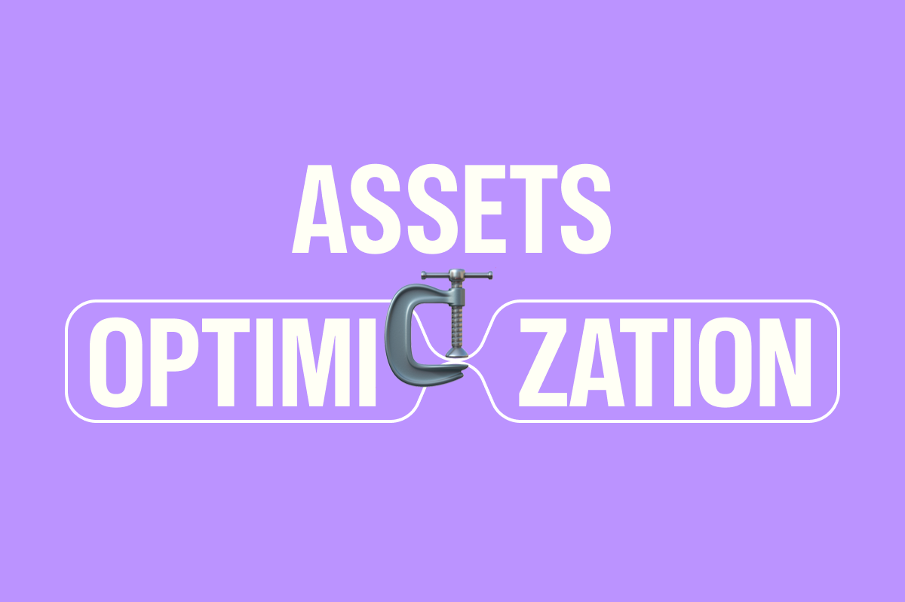

# DatoCMS Asset Optimization Plugin

A plugin that allows you to mass apply optimizations to your DatoCMS assets, significantly reducing image file sizes while maintaining visual quality.



## Overview

The DatoCMS Asset Optimization Plugin leverages Imgix's powerful image processing capabilities to optimize your media library assets. It helps you:

- Reduce image file sizes without sacrificing quality
- Apply batch optimization to multiple assets
- Configure quality levels based on asset sizes
- Convert images to modern formats like AVIF or WebP
- Track optimization progress with detailed logs
- View statistics on storage savings

## Installation

1. Log in to your DatoCMS project
2. Go to Settings > Plugins
3. Search for "Asset Optimization"
4. Click "Install"
5. Configure the plugin settings as desired

## Important: Use Sandbox Environments First

⚠️ **STRONGLY RECOMMENDED**: Always test this plugin in a sandbox environment before using it in production.

This plugin permanently replaces your original assets and they cannot be recovered. To ensure optimal results:

1. Create a sandbox environment in your DatoCMS project
2. Test the plugin with various optimization settings
3. Fine-tune thresholds and quality settings to your liking
4. Verify the optimized assets meet your quality standards
5. Once satisfied with the results, promote your changes to production

This approach allows you to safely experiment with different optimization parameters without risking your production assets.

## Usage

1. After installation, navigate to the plugin in your DatoCMS dashboard
2. Configure the optimization settings according to your needs
3. Click "Start Optimization" to begin the process
4. Watch the progress as the plugin processes your assets
5. View the results including statistics on size savings

### Asset Filtering & Optimization

- **Size-Based Filtering**: Only process assets above a certain size threshold
- **Intelligent Optimization**: Apply different optimization strategies based on asset size categories
- **Format Conversion**: Convert images to modern formats like AVIF for better compression
- **Dimension Resizing**: Automatically resize oversized images while maintaining aspect ratio

### Website Performance Optimization

- Reduce page load times by decreasing image payload sizes
- Improve Core Web Vitals scores with optimized images
- Enhance mobile experience with appropriately sized images

### Storage Cost Reduction

- Minimize storage usage in your DatoCMS media library
- Reduce CDN bandwidth consumption
- Lower operating costs while maintaining quality

### Batch Processing

- Mass-update existing media libraries with optimized assets
- Apply consistent optimization settings across your entire asset collection
- Save time compared to manual optimization workflows

## Development

### Prerequisites

- Node.js (v14+)
- npm or yarn
- DatoCMS account with developer access

### Local Development

1. Clone the repository
2. Install dependencies: `npm install`
3. Start the development server: `npm run dev`
4. Configure a local DatoCMS plugin in your project settings pointing to your local server

### Building for Production

```bash
npm run build
```

The built files will be in the `dist` directory, ready for deployment.

## Support

If you encounter any issues or have questions about the plugin, please [open an issue](https://github.com/marcelofinamorvieira/datocms-plugin-asset-optimization/issues) on GitHub.

## License

MIT
