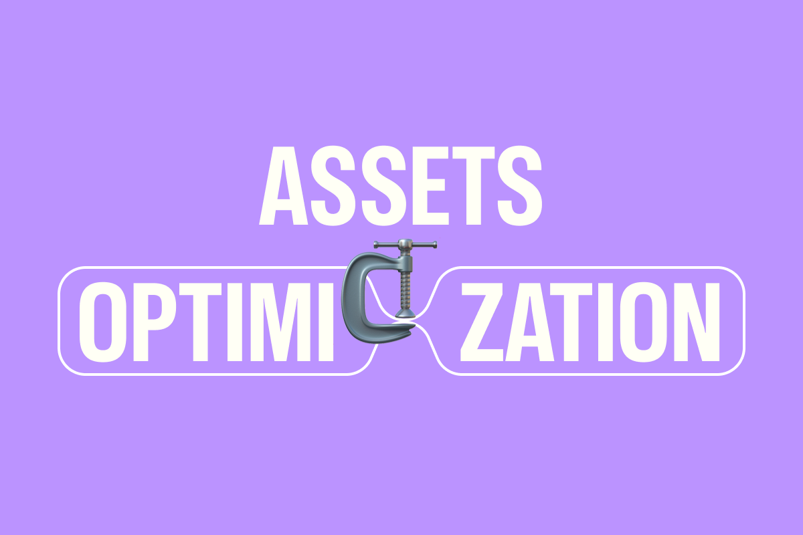

# Asset Optimization

Shrinks the large images in your DatoCMS media library by running them through Imgix with the compression, resizing and format settings you choose, then replacing the originals with the smaller versions.



## Before you start

Replacing an asset is permanent and the original can't be recovered. Try the plugin in a sandbox environment first, tune the settings until you're happy with the results, and only then run it on your primary environment.

## Usage

Install the plugin and allow it to use the current user's API token, which it needs to replace assets. Then open **Configuration → Asset Management → Optimize assets** (the plugin's settings screen also links there).

Only images at or above the **Large Asset** size threshold are processed. Images above the **Very Large Asset** threshold get their own quality and max width. You can also limit a run to a single asset collection (subcollections aren't included). Other settings let you keep the original format or convert to WebP or AVIF, resize large images, and switch on lossless compression or other Imgix options. **Minimum Size Reduction** skips any image that wouldn't shrink by at least that percentage.

Click **Preview Optimization** to see the expected savings without changing anything. When the numbers look right, click **Start Optimization** and confirm twice. Keep the page open until the run finishes. At the end you get lists of the optimized, skipped and failed assets. **Cancel** stops new work, but replacements already sent will still complete.

A replaced asset keeps its ID, so records that use it are unaffected, along with its metadata, tags and collection. If you convert to another format, the asset gets a new URL, and any copy of the old URL saved outside DatoCMS won't be updated.

## Development

```bash
npm install
npm run dev
npm run check
```

Issues go to the [plugin repository](https://github.com/marcelofinamorvieira/datocms-plugin-asset-optimization/issues).
