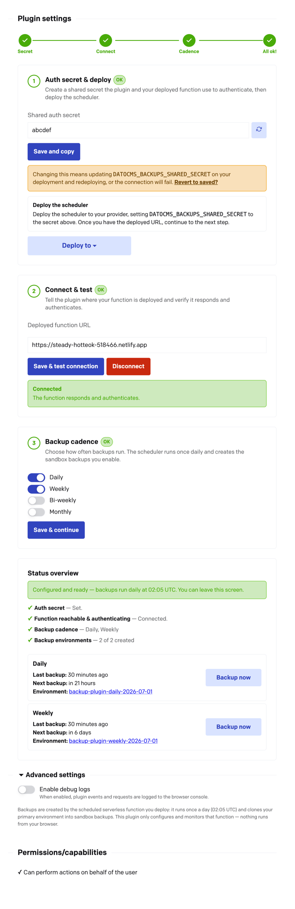

# Automatic Environment Backups

This plugin creates automatic, rotating backups of your DatoCMS primary environment by cloning them into sandbox environments within the same project.

Because DatoCMS does not have a built-in job scheduler, the plugin has to create an external scheduled lambda (serverless function) to invoke the backup functionality on a recurring basis. It currently supports deployments to Vercel, Cloudflare, and Netlify.

The lambda function is only used as a job scheduler, similar to a cronjob. The lambda calls the DatoCMS Content Management API (CMA) to actually manage the environments and perform the backups.

## How it works

- The plugin's configuration screen is a guided, four-step wizard with a progress bar showing the state of each step.
- Backup cadence is configured in the plugin (`daily`, `weekly`, `bi-weekly`, `monthly`).
- The deployed scheduler runs once a day (02:05 UTC) and calls the backup endpoints.
- The plugin validates connectivity to the serverless function with a health check against `/api/datocms/plugin-health`, authenticated with a shared secret.
- The **Status overview** lists each enabled cadence with its last run, next scheduled run, and the linked sandbox environment, plus a per-cadence **Backup now** button for on-demand execution.
- The created backups are just forked sandboxes inside your DatoCMS project (named with a `backup-plugin-<cadence>` prefix), NOT separate files on an external provider. The external providers are only used to run the scheduled function that calls the CMA to create a backup.
- Source code for the deployed lambda function is at https://github.com/marcelofinamorvieira/datocms-backups-scheduled-function (this lambda was written by Marcelo Finamor, a DatoCMS employee).

## Before you begin

- You will need an account with Vercel, Netlify, or Cloudflare that is capable of creating projects and adding serverless functions (lambdas). Usually the free plan will suffice.
- In your DatoCMS project, you will have to create a new API token with access to the CMA and an admin role. In older DatoCMS projects, this may have been automatically created as a "Full Access API Token", but newer projects will require manual creation of a similar token.

## Setup

The configuration screen walks you through four steps. Completed steps collapse to a summary you can re-open with **Edit**; the progress bar at the top shows overall state and reads **All ok!** once everything is configured.

1. Read the "Before you begin" section above, then install the plugin and open your DatoCMS project Configuration → Plugins → Automatic Environment Backups.
2. **Step 1 — Auth secret & deploy.** A strong shared secret is generated for you (use the regenerate icon to roll a new one). Click **Save and copy** to store it and copy it to your clipboard. Then click **Deploy to…** and pick a provider. On the provider, set the `DATOCMS_BACKUPS_SHARED_SECRET` environment variable to the secret you just copied, and `DATOCMS_FULLACCESS_API_TOKEN` to your CMA/admin token. Deploy, then copy the deployment's public URL (e.g. `https://my-backups.netlify.app`).
3. **Step 2 — Connect & test.** Paste the deployed URL into **Deployed function URL** and click **Save & test connection**. The status box confirms the function responds and authenticates, or shows the exact error (for example, an auth mismatch means the plugin's secret and the provider's `DATOCMS_BACKUPS_SHARED_SECRET` differ — make them match and redeploy).
4. **Step 3 — Backup cadence.** Toggle the cadences you want and click **Save & continue**. The plugin creates any missing backup environments for the enabled cadences.
5. **Status overview.** Once all three steps are green, the overview shows "Configured and ready", plus the last/next backup and linked environment for each cadence and a per-cadence **Backup now** button. You can leave the screen — backups run on their own.

## Managing the connection

- Re-open any completed step with its **Edit** button to change the secret, URL, or cadence. Each step re-validates and re-gates the later steps when needed — for example, changing the shared secret clears the connection so you re-test it (remember to update `DATOCMS_BACKUPS_SHARED_SECRET` on your deployment and redeploy).
- Use **Disconnect** in step 2 to clear the saved deployment URL. The cron schedule on the external provider keeps running until you remove the deployment there, but the plugin will no longer surface its status.
- Re-opening the configuration screen automatically re-runs a health check against the saved URL, so a broken or expired deployment is caught immediately and surfaced on the affected step (and in the Status overview).

## Advanced settings

- **Enable debug logs** — When enabled, plugin events and outbound requests are logged to the browser console for troubleshooting.

## Changelog

See [CHANGELOG.md](CHANGELOG.md).
