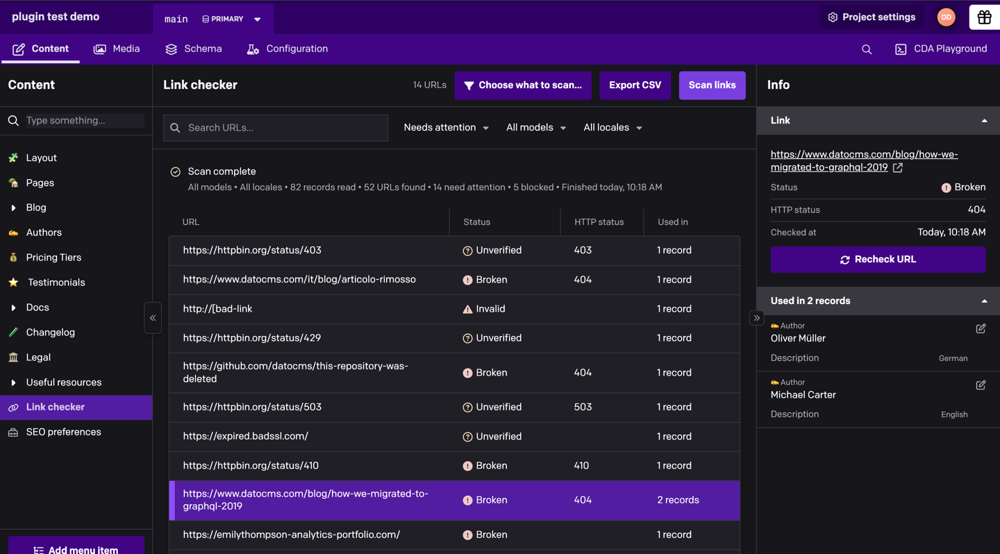
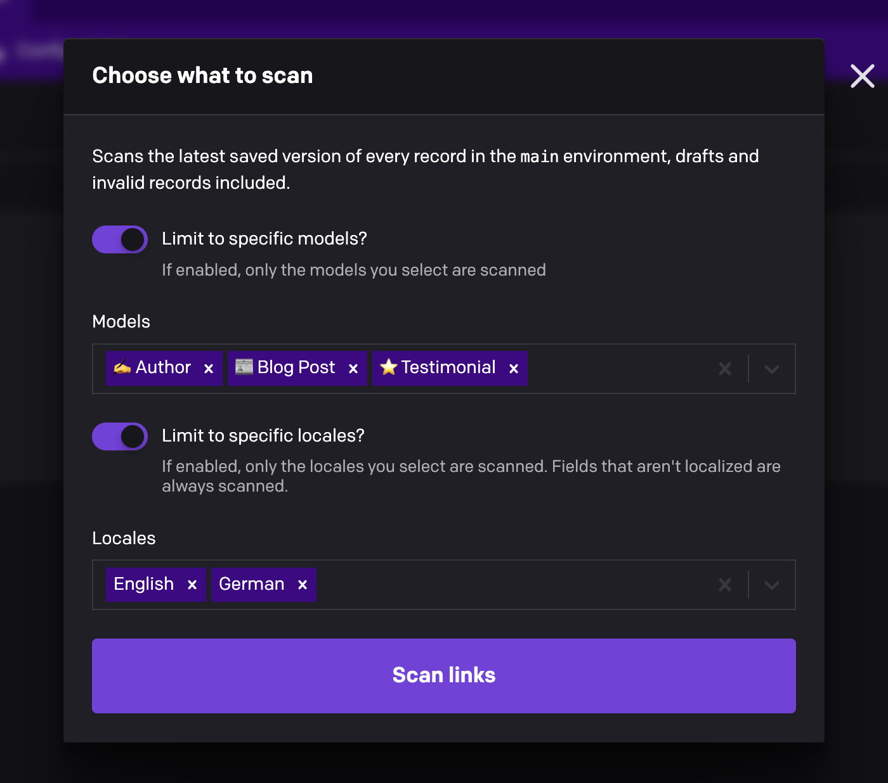
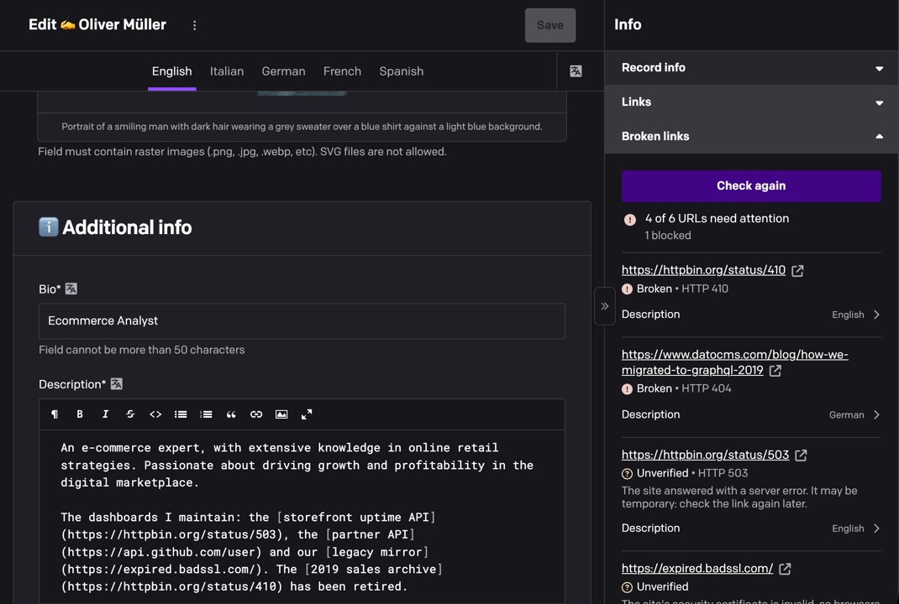
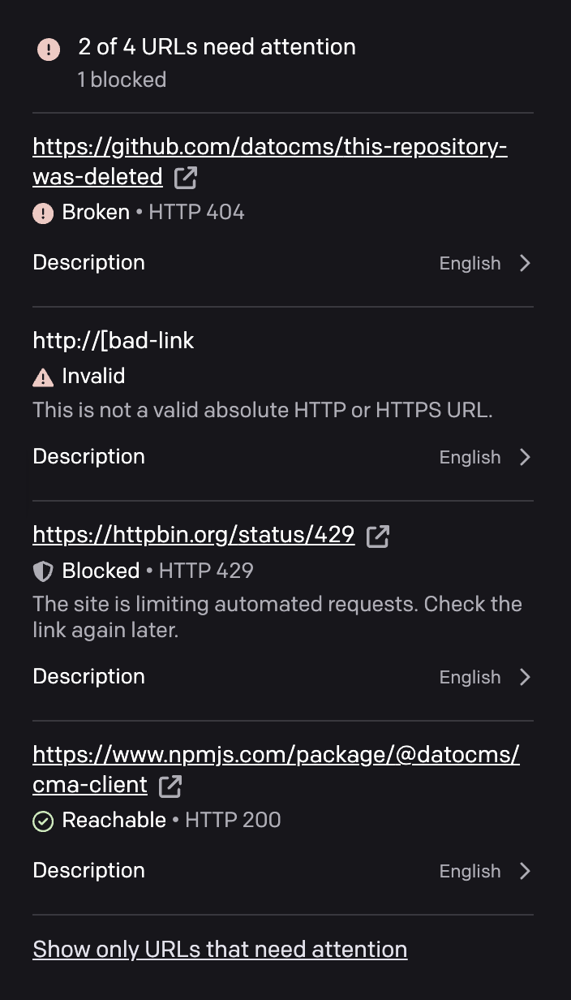

# Broken Link Checker

Find broken links in your DatoCMS content before your visitors do. Scan the whole project to see every link that needs fixing and exactly where it's used, or check a single record right from its sidebar.



- **Scan the whole project**, or only the models and locales you pick
- **One row per link**, with every record, field and locale that uses it
- **Check a single record** from its sidebar, unsaved changes included
- **Plain-language results** instead of raw error codes, and no false alarms from sites that block automated checks
- **Read-only**: the plugin never changes your content

## Installation

Install **Broken Link Checker** from **Configuration → Plugins** and, when asked, let it use the current user's API token. The project scan needs it to read your records. There's nothing else to configure.

Without that permission, the record sidebar check still works, but the Link checker page is hidden.

## Scan your project

1. Open **Content → Link checker** and click **Scan links**.
2. Links that need attention show up as soon as they're checked, while a progress bar tracks the scan. **Cancel scan** stops it and keeps what was found so far.
3. Select a link to see its status, the HTTP response and every place it's used. Open a record from there to fix the link without leaving the page, then click **Recheck URL**.

The menus above the table switch between **Needs attention**, **All URLs** or a single status, filter by model or locale, and search the URLs. **Export CSV** downloads the whole report.

The scan reads the latest saved version of every record in the current environment, drafts and invalid records included. Results stay on the page until you leave it, so export them if you want to keep a copy.

### Choose what to scan

To scan only some models or locales, click **Choose what to scan…**, turn on the limits you need and pick what to include. **Scan links** keeps using that choice until you change it.



## Check a single record

Open a record, expand **Broken links** in its sidebar and click **Check links**. Every locale is checked, including changes you haven't saved yet. Each result shows the field and locale that use the link: click it to jump to that field. Once you've fixed it, click **Check again**.



## Understanding the results

Every result comes with a short explanation, on the Link checker page and in the record sidebar alike.



| Status | What it means |
| --- | --- |
| **Broken** | The page doesn't exist (HTTP 404 or 410), or the website's domain doesn't exist. |
| **Unverified** | The check couldn't confirm the link: a server error, an invalid security certificate, no response, or another unexpected answer. The result says which. |
| **Invalid** | The address is malformed, like `http://[bad-link`. |
| **Blocked** | The website refused the automated check with bot protection, rate limiting or a sign-in page. This usually isn't a problem with the link. |
| **Reachable** | The link works. |
| **Skipped** | Not a public web address: `mailto:` links, relative paths, `localhost` and private IP addresses aren't checked. |
| **Not checked** | The scan was canceled before reaching it. |

**Needs attention** covers Broken, Unverified, Invalid and Not checked links. Blocked links are counted separately ("5 blocked") and have their own entry in the status menu.

**Why "Blocked"?** Links are checked through DatoCMS's link-checking service, so websites see an automated request instead of a visitor. Many sites guard against those with services like Cloudflare and answer with a challenge page instead of the real one. The plugin recognizes these answers and reports the link as Blocked rather than broken. Open it to check it yourself.

## Good to know

- **What's scanned:** single-line text fields that hold a URL, multi-paragraph text (plain, Markdown or HTML), Structured Text links, and everything inside Modular Content, Single Block and Structured Text blocks.
- **Anchors aren't checked.** Only the part before `#` is requested, so a missing anchor on an existing page isn't detected.
- **A page that loads isn't always the right page.** A login screen or a "not found" message served as a normal page still counts as reachable.
- **Your role applies.** The scan only reads records you can read, and the report lists anything it couldn't read so you know what's missing.
- **Checks are gentle on websites:** at most four at a time, one per website, with a 10-second timeout.

## Development

From this directory:

```sh
npm ci
npm run dev
npm test
npm run lint
npm run build
```

Connect the development URL to a test project using the [DatoCMS plugin development workflow](https://www.datocms.com/docs/plugin-sdk/build-your-first-plugin). Automated coverage and the host validation checklist are in [docs/VALIDATION.md](docs/VALIDATION.md).
