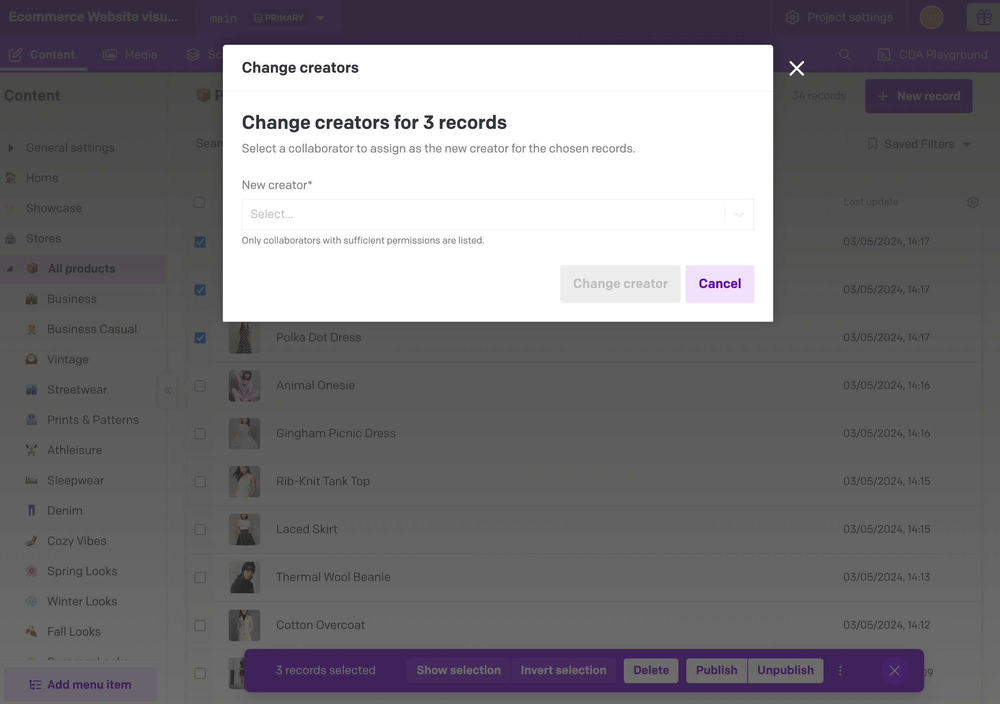

# Bulk Change Author for DatoCMS

Give editors a fast, safe way to transfer ownership of many records at once. The **Bulk Change Author** plugin adds a Global Record Action to DatoCMS that lets you pick a collaborator and reassign the `creator` metadata across multiple entries in just a few clicks.



---

## Why use this plugin?

- **Speed up editorial workflows:** Update dozens (or hundreds) of items without manual edits or API scripts.
- **Stay permission-aware:** Uses the current editor’s access token, so DatoCMS enforces “Edit creator” permissions automatically.
- **Consistent UX:** Leverages Dato’s native dropdown action menu and modal styling so the feature feels built-in.
- **Error visibility:** Summarizes successes and per-record failures, making it clear when additional permissions or retries are needed.

---

## Features at a glance

- Registers a **Global Record Action** labelled “Change creators…” in both the collection (table) view and the record detail view.
- Opens a modal that fetches the project’s collaborators from the Content Management API (`users.list()`), letting the editor pick one collaborator.
- Performs bulk `items.update()` calls with gentle concurrency limits to respect rate limits.
- Displays post-action notices/alerts, including individual failure messages for items that could not be updated.
- Works in the active environment (primary or sandbox) thanks to `ctx.environment`.

---

## Installation

1. Clone or download this repository.
2. Install dependencies:

   ```bash
   pnpm install
   ```

3. Start the dev server:

   ```bash
   pnpm dev
   ```

4. In your DatoCMS project, go to **Settings → Plugins → Add new plugin → Create a new plugin**.
5. Paste the local dev server URL (default `http://localhost:5173`) in the manual plugin URL field.
6. Ensure the plugin has the `currentUserAccessToken` permission enabled. It’s required to perform CMA calls on behalf of the editor.

When you’re ready to ship, run `pnpm build` and upload the contents of the `dist/` folder to DatoCMS or host them on a CDN.

---

## Usage

1. Navigate to any collection view or open a record detail page.
2. Select the entries you want to update (or open the record’s dropdown).
3. Choose **Change creators…** from the dropdown action list.
4. In the modal, pick the collaborator who should become the new creator.
5. Confirm; the plugin updates all selected items and reports any failures.

> Tip: If you see “403 Forbidden” errors, make sure your role grants “Edit creator” permission for the relevant models.

---

## Development notes

- **Tech stack:** React 18, Vite, TypeScript, `datocms-plugin-sdk`, `datocms-react-ui`, and the browser-ready `@datocms/cma-client-browser`.
- **Key entry points:**
  - `src/main.tsx` – registers the dropdown action, executes the modal, and handles result notices.
  - `src/entrypoints/SelectCreatorModal.tsx` – modal UI and collaborator loading logic.
  - `src/actions/bulkChangeCreator.ts` – concurrency-limited CMA updates.
- **Environment awareness:** The CMA client respects the current environment via `ctx.environment`.

---

## Roadmap ideas

- Combine regular and SSO collaborators in the picker.
- Remember the last selected collaborator per editor session.
- Allow filtering by role before rendering the dropdown options.

Contributions and suggestions are welcome—feel free to open issues or PRs. If you use this plugin in production, we’d love to hear your feedback!
