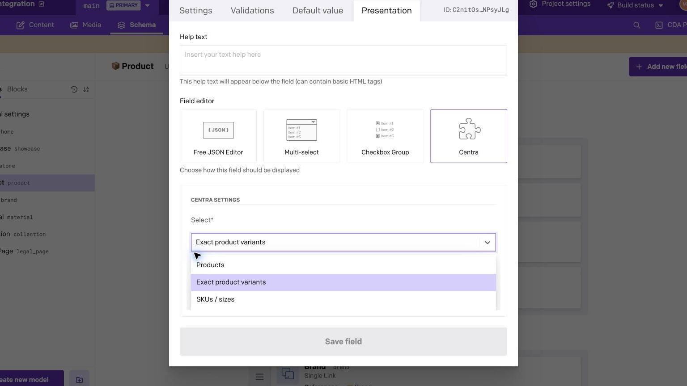
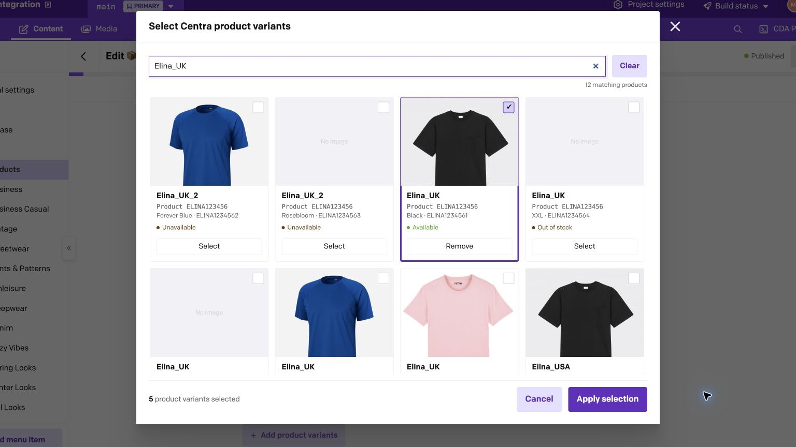
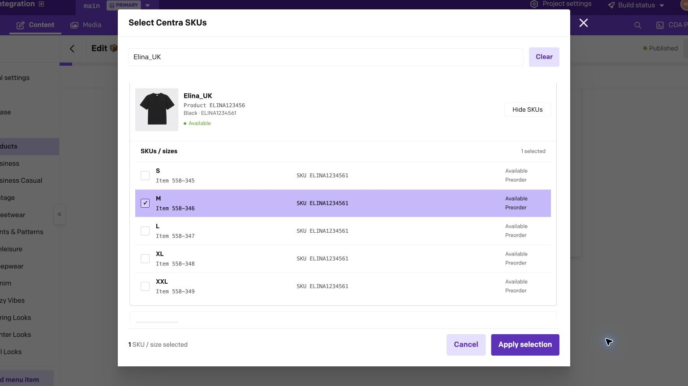
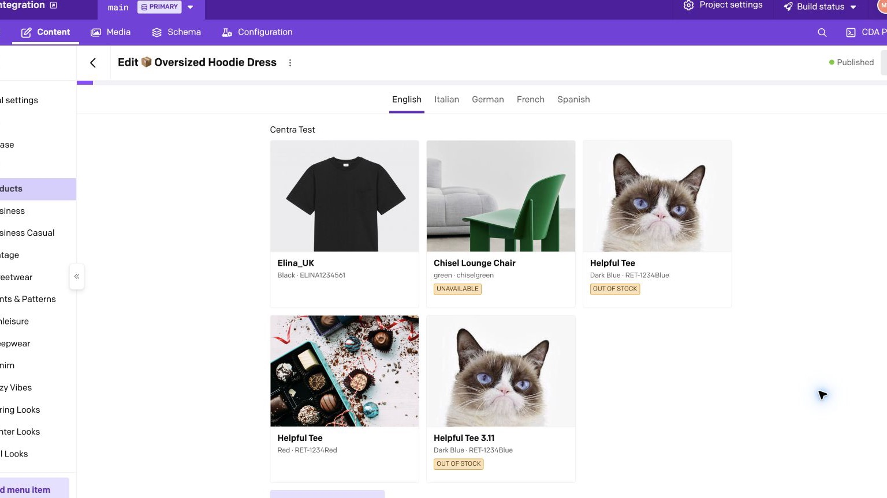

# Centra for DatoCMS

Select Centra products, exact product variants, and buyable SKU/size items directly from DatoCMS records.

Centra remains the source of truth for catalog data. The plugin stores only stable reference IDs in DatoCMS and loads names, media, prices, availability, stock, SKU values, and other product details live from Centra.

## Features

- Product picker restricted to each display's primary variant
- Exact product-variant picker
- SKU/size picker backed by Centra `Item` IDs
- Single and ordered multiple selections
- Product-first search with SKU, size, product-number, variant, and GTIN discovery
- Live product cards with unresolved and availability states
- Light and dark mode support through DatoCMS UI tokens

## Configuration

Open the plugin settings and enter:

1. **Storefront API URL** — the complete Centra no-session GraphQL URL.
2. **API token** — a read-only token for that endpoint.

Select **Save and connect**. The plugin validates the credentials by loading one
catalog page before saving. The same Centra connection is used in every DatoCMS
environment.

## Adding a Centra field

1. Create a DatoCMS **JSON** field.
2. In the field's **Presentation** settings, choose **Centra**.
3. Choose the reference kind:
   - **Product (primary variant)** — browse one primary DisplayItem per product display.
   - **Exact variant** — browse every DisplayItem/product variant.
   - **SKU / size** — choose a nested Centra Item.
4. Choose **Single** or **Multiple** cardinality.

Changing a populated field to an incompatible kind or changing a multi-value field with several references to single cardinality does not discard or reinterpret data. The editor asks for an explicit clear or replacement.

## Editor workflow

### Choose what editors can select

Configure the JSON field for products, exact product variants, or individual SKU/size items.



### Search and select exact variants

Search the live Centra catalog, compare image-backed variants, and stage one or more selections before applying them.



### Select a specific SKU or size

Expand a product variant and select the exact Centra Item. Repeated SKU strings remain separate rows with their own size and Item ID.



### Work with hydrated references

Saved references are rendered with current Centra images, variant details, and availability while the JSON value keeps only stable IDs.



## Stored value contract

The JSON field contains a versioned document. `null` is the only empty value.

### One product

```json
{
  "version": 1,
  "kind": "primaryProduct",
  "references": [{ "displayItemId": 2752 }]
}
```

### Ordered product variants

```json
{
  "version": 1,
  "kind": "variant",
  "references": [
    { "displayItemId": 2752 },
    { "displayItemId": 2810 }
  ]
}
```

### One SKU/size item

```json
{
  "version": 1,
  "kind": "item",
  "references": [
    {
      "displayItemId": 2752,
      "itemId": "opaque-centra-item-id"
    }
  ]
}
```

The plugin intentionally does not store product names, URIs, images, prices, stock, SKU strings, GTINs, or full product snapshots. Those values can change in Centra and are loaded live.

## Resolving references in a frontend

Query the JSON field from DatoCMS using its API key. The Content Delivery API returns the field as a JSON-encoded string, or `null` when the field is empty. Replace `centraProducts` below with your field's API key.

```graphql
query ProductPage {
  product {
    centraProducts
  }
}
```

The response contains a string rather than a parsed reference document:

```json
{
  "data": {
    "product": {
      "centraProducts": "{\"version\":1,\"kind\":\"variant\",\"references\":[{\"displayItemId\":2752}]}"
    }
  }
}
```

Parse the field before reading its references:

```ts
type CentraReferenceDocument =
  | {
      version: 1;
      kind: 'primaryProduct' | 'variant';
      references: Array<{ displayItemId: number }>;
    }
  | {
      version: 1;
      kind: 'item';
      references: Array<{
        displayItemId: number;
        itemId: string;
      }>;
    };

function parseCentraField(
  rawValue: string | null,
): CentraReferenceDocument | null {
  if (rawValue === null) return null;

  // Add runtime validation for the version, kind, and reference shape
  // before using this data in production.
  return JSON.parse(rawValue) as CentraReferenceDocument;
}

const document = parseCentraField(data.product.centraProducts);
const displayItemIds = [
  ...new Set(
    document?.references.map(({ displayItemId }) => displayItemId) ?? [],
  ),
];
```

After parsing the DatoCMS value, fetch the referenced DisplayItems from Centra using those numeric IDs:

```graphql
query ResolveCentraReferences(
  $displayItemIds: [Int!]
  $market: [Int!]
  $pricelist: [Int!]
  $languageCode: [String!]
) {
  displayItems(
    where: { id: $displayItemIds }
    limit: 100
    market: $market
    pricelist: $pricelist
    languageCode: $languageCode
  ) {
    list {
      id
      name
      productNumber
      isPrimaryVariant
      available
      hasStock
      productVariant {
        id
        name
        number
      }
      items {
        id
        name
        sku
        GTIN
        preorder
        stock {
          available
        }
      }
    }
  }
}
```

Centra may return DisplayItems in a different order. Reorder them using the parsed `references` array, and keep a placeholder for any missing DisplayItem instead of silently dropping the saved reference.

## SKU behavior

For a field configured for SKUs/sizes, parsing the DatoCMS JSON string produces a document with `kind: 'item'`. Each reference contains the parent DisplayItem ID and the exact nested Centra Item ID:

```ts
const document = parseCentraField(data.product.centraSkus);

if (document?.kind === 'item') {
  const displayItemsById = new Map(
    displayItems.map((displayItem) => [displayItem.id, displayItem]),
  );

  const resolvedSkus = document.references.map((reference) => {
    const displayItem = displayItemsById.get(reference.displayItemId);
    const item =
      displayItem?.items.find(({ id }) => id === reference.itemId) ?? null;

    return { reference, displayItem, item };
  });
}
```

In this example, `displayItems` is the list returned by the Centra query above. Mapping over the parsed `references` array preserves the editor-defined order. Keep entries with a missing `displayItem` or `item` visible in your application rather than silently dropping them.

SKU and GTIN values are searchable display metadata, not identity. Centra catalogs can contain duplicate SKU values, even within the same DisplayItem, so frontend code must not resolve a selection by SKU or GTIN. The stable identity is the stored `displayItemId` and `itemId` pair.

## Availability and stock

Market, pricelist, language, and Centra allocation rules can change what is visible or available. Product and item stock shown in DatoCMS is the current Storefront API response, not a guarantee that checkout will succeed later.

Missing or inactive references remain visible in the field editor with their stored IDs so editors can remove or replace them deliberately.

## Troubleshooting

### Connection test fails

- Confirm the URL is the complete no-session GraphQL endpoint.
- Confirm the bearer token belongs to the same Storefront API plugin.
- Avoid using the AMS URL as the API endpoint.
- Inspect the HTTP or GraphQL error shown by the plugin; credentials are redacted from messages.

### Prices or translations differ from the Centra backoffice

The plugin uses the market, pricelist, and language defaults exposed by the
configured no-session endpoint. Adjust those defaults in Centra if the catalog
response is not the one editors should browse.

### A primary product now shows a warning

The selected DisplayItem is pinned. If Centra later assigns another primary variant, the plugin warns and leaves the existing reference untouched. Replace it explicitly if the content should follow the new primary choice.
