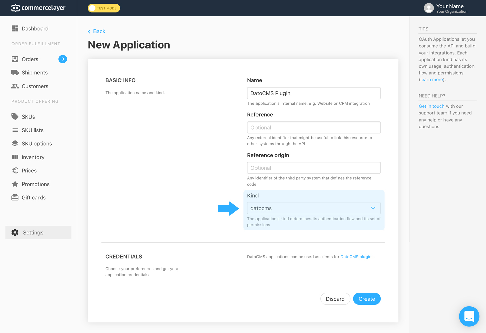

# DatoCMS Commerce Layer plugin

A plugin that allows users to search and select Commerce Layer SKUs.

## Credentials (Commerce Layer)

Go in your Commerce Layer project > Settings > Applications and create a new `datocms` application. It should look something like this:

Get the application's Base endpoint and Client ID:

## Configuration (DatoCMS)

Please specify your Commerce Layer parameters on the plugin global settings:

