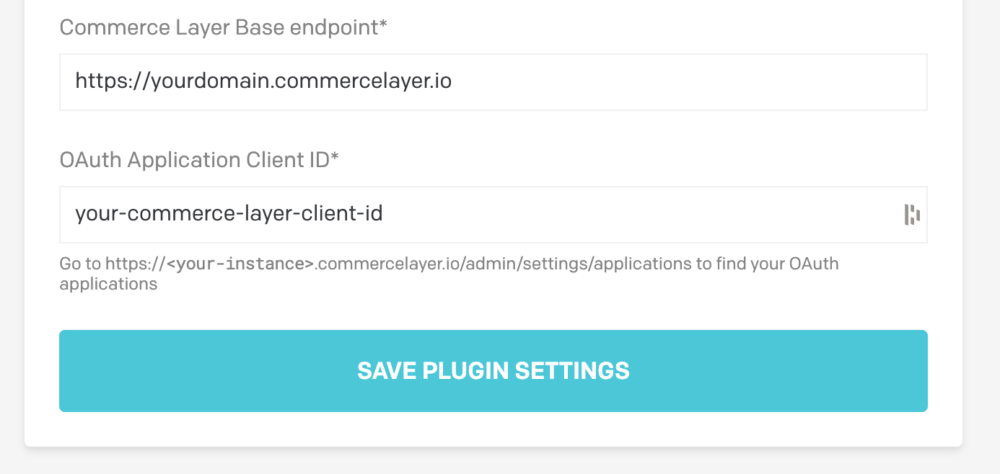

# DatoCMS Commerce Layer plugin

A plugin that allows users to search and select Commerce Layer SKUs.

## Credentials (Commerce Layer)

Create a new `datocms` application on Commerce Layer:

Get the application's Base endpoint, Client ID, and client Secret:

## Configuration (DatoCMS)

Please specify your Commerce Layer parameters on the plugin global settings:

