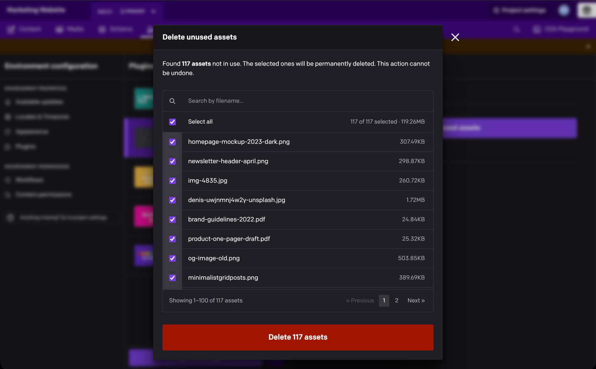

# Delete Unused Assets

Clean up your media library in one go. The plugin finds every asset that no record uses, lets you review the list and keep anything you still need, then deletes the rest and tells you how much storage you freed.



- **Finds every unused asset** in the current environment, however large the library
- **Review before deleting**: every asset is listed with its size, and you can untick or search for the ones to keep
- **Rechecked right before deletion**: an asset that a record starts using in the meantime is kept
- **Live progress and a clear summary**: running counts while it works, then how many assets were deleted and how much storage was freed
- **Nothing to configure**

## Installation

Install **Delete Unused Assets** from **Configuration → Plugins** and, when asked, let it use the current user's API token. The plugin needs it to find and delete assets. There's nothing else to set up.

## Delete unused assets

1. Open **Configuration → Plugins → Delete Unused Assets** and click **Scan for unused assets**.
2. The plugin checks your whole asset library and lists every asset that no record uses, with its size. All of them start selected.
3. Untick anything you want to keep. **Select all** ticks or clears the whole list, and the search box filters it by filename.
4. Click **Delete *N* assets**, where *N* is the number of selected assets. A progress bar and running counts follow the deletion.
5. When it's done, a summary shows how many assets were deleted and how much storage was freed.

### Keep what you still need

Search by filename to find a group of assets quickly, then untick the ones to keep. While a search is active, **Select all matches** only changes the matching assets. Assets selected outside the search stay selected and are still deleted: the count next to it always covers the whole selection.


### While it deletes

Assets are deleted in batches of 100. Right before each batch, the plugin checks again which assets are unused: anything a record started using since the scan is kept, and anything someone else removed in the meantime is counted as already removed. Keep the window open until the deletion finishes.

For more than 100 assets, **Stop** ends the deletion after the current batch. Assets deleted until then stay deleted; the rest are left untouched.


## Understanding the summary


| Count | What it means |
| --- | --- |
| **Assets deleted** | Permanently removed from your project. |
| **Storage freed** | The total size of the deleted assets. It's marked *estimated* when DatoCMS can't say exactly which assets a batch removed, for example because someone else deleted assets at the same time. |
| **Kept because they are in use** | A record started using the asset after the scan, so it wasn't deleted. |
| **Already removed** | The asset was already gone when the plugin got to it, usually because someone deleted it elsewhere. |
| **Failed** | DatoCMS couldn't delete the asset. |
| **Not processed** | The deletion was stopped or interrupted before reaching the asset. |

Only the counts that apply are shown. A run that was stopped or didn't complete says so, and never reports success.

## Good to know

- **Deletion is permanent.** There's no undo.
- **"Unused" means no record uses it.** The plugin relies on DatoCMS's own usage tracking, which covers the current and published version of every record. An asset that's only linked from outside DatoCMS (a hard-coded URL on your website or in an email template) or only from an older version of a record counts as unused. Untick it to keep it.
- **One environment at a time.** The scan covers the environment you're in, and your role decides which assets you can see and delete.
- **Closing the dialog stops the deletion** after the current batch. A batch DatoCMS has already accepted still finishes on the server.
- **Large libraries are fine.** The scan reads the library in pages and shows its progress, and the list shows 100 assets per page.
- **If the library changes during the scan**, because assets are added or deleted elsewhere, the plugin starts the scan over, up to three attempts in total. If the scan can't finish, you see an error and nothing is deleted.

## Development

From this directory:

```sh
npm ci
npm run dev
npm test
npm run lint
npm run build
```

`npm run check` runs lint, build and tests together. [docs/technical-notes.md](docs/technical-notes.md) explains how the scan and deletion work, how they're tested and which API contracts they rely on.
