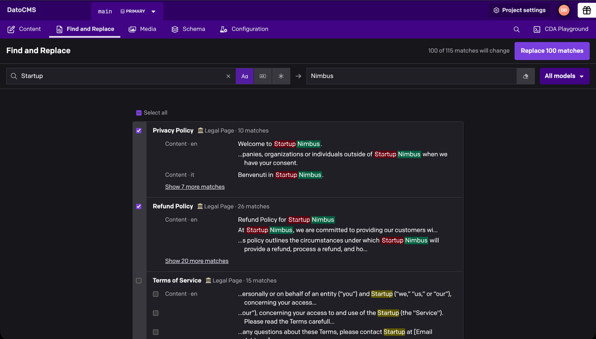
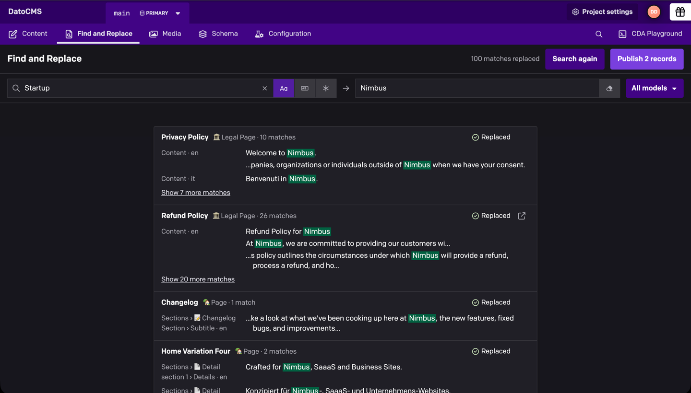

# Find and Replace

Searches every text field of every record for a word or pattern and replaces it across the project. You see each change before it's made, can leave out anything you want to keep, and publish when you're ready.



## Installation

Install **Find and Replace** from **Configuration → Plugins** and, when asked, let it use the current user's API token, which it needs to read and update records. A **Find and Replace** tab then appears in the top navigation.

By default anyone whose role can read and update a model can use it on that model's records. In the plugin settings you can restrict it to some roles or limit which models it can change.

## Finding text

Type in **Find**. Matches show up grouped by record, with the field, locale and a line of context. The search covers titles, text, slugs, Structured Text, SEO fields and text inside blocks at any depth, in every locale. In projects with more than 10,000 records, press Enter to start the search.

You can match case, match whole words, or use a regular expression (JavaScript syntax, with `$1`, `$<name>` and `$&` available in the replacement). Without whole-word matching, "Startup" also matches inside "Startups".

## Replacing

Type the new text in **Replace with** and every match turns into a before-and-after preview. Uncheck the records or single matches you want to keep, click **Replace N matches** and confirm. To delete the matched text, turn on **Replace with nothing**; an empty replacement field on its own never deletes anything.

Slug matches start unchecked, because changing a slug changes the record's URL. In Structured Text, link text can be replaced but the link and any linked record are left alone.

Records are updated one at a time. If someone edited a record after your search, it's skipped rather than overwritten, and **Search again** picks up the current text. A record that fails is usually breaking a field validation, and the reason is shown under it. Keep the page open until the run finishes. A single search stops at 10,000 matches; replace those and search again for the rest.

## Publishing

In models with draft/published, replacing saves a draft and nothing goes live until you click **Publish N records** (shown if your role can publish). Only records whose sole unpublished change is your replacement are offered, so publishing never puts other pending edits live. Records that already had unpublished changes, or were never published, stay drafts and say why.



In models without draft/published, records change on your website as soon as they're replaced. The confirmation dialog warns you before you start.

## Development

```sh
npm ci
npm run dev
npm test
npm run build
```

`npm run harness` opens a local preview of the page with sample content, without a DatoCMS project.
