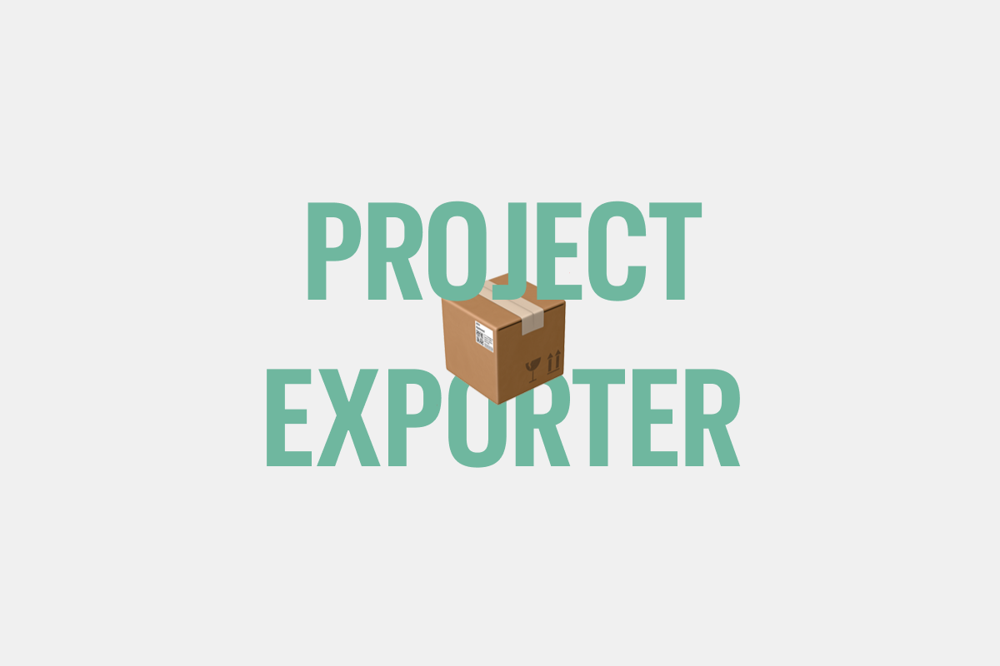

# DatoCMS Project Exporter Plugin

A powerful DatoCMS plugin that allows you to export your project's records and assets directly from the dashboard. Whether you need a complete backup, a specific set of data for analysis, or just a single record, Project Exporter handles it with support for multiple popular formats.



## Features

- **Multiple Export Formats**: Export your data in JSON, CSV, XML, or XLSX.
- **Bulk Record Export**: Download all records in your project.
- **Filtered Exports**:
  - **By Model**: Select specific models to export records from.
  - **By Text Search**: Export records matching a specific search query.
- **Import-Friendly JSON Envelope**: JSON exports include `manifest`, schema ID/API-key maps, `projectConfiguration` (site/settings resources), and a `referenceIndex` for records/uploads/blocks/structured-text links.
- **Chunked Asset Export**: Assets are split into conservative multi-ZIP chunks to reduce browser memory pressure.
- **Asset Mapping Manifests**: Every ZIP includes `manifest.json` and deterministic filename conventions for easier re-import.
- **Single Record Export**: JSON single-record exports use the same envelope shape as bulk JSON exports.

## Installation

1.  Go to your DatoCMS project dashboard.
2.  Navigate to **Settings** > **Plugins**.
3.  Click the **Plus** icon to add a new plugin.
4.  Search for **Project Exporter** or install it manually using the package name `datocms-plugin-project-exporter`.

## Configuration

Once installed, you can configure the default export format in the plugin settings:

1.  Navigate to **Settings** > **Plugins**.
2.  Click on **Project Exporter**.
3.  In the configuration area (or via the plugin's main page), you can select your preferred default format:
    - `JSON`
    - `CSV`
    - `XML`
    - `XLSX`

*Note: You can also change the format on-the-fly when performing an export.*

## Usage

### Exporting Records (Bulk)

To perform bulk exports, navigate to the plugin's configuration screen (typically found under **Settings** > **Plugins** > **Project Exporter** > **Config Screen** or the dedicated plugin page if applicable).

1.  **Select Format**: Choose between JSON, CSV, XML, or XLSX from the dropdown menu.
2.  **Filter by Model**: Use the dropdown to select one or multiple models. Click "Download records from selected models" to export only those records.
3.  **Filter by Text**: Enter a search term in the text field. Click "Download records from text query" to export matches.
4.  **Export All**: Click "Download all records" to export everything.

### Exporting Assets

1.  On the main plugin screen, click the **Download all assets** button.
2.  The plugin scans assets and creates one or more ZIP files using conservative limits.
3.  Every ZIP includes:
    - Asset binaries
    - `manifest.json` with source upload IDs and metadata
4.  ZIP entry filenames follow:
    - `u_<sourceUploadId>__<sanitizedOriginalFilename>`

### Exporting a Single Record

When editing a specific record:

1.  Look for the **Record Downloader** panel in the right sidebar.
2.  Click **Download this record**.
3.  The record will be downloaded in the format currently selected in the plugin's global configuration.

## Development

This plugin is built with React and the DatoCMS Plugin SDK. To contribute or modify the plugin locally:

1.  Clone the repository:
    ```bash
    git clone https://github.com/marcelofinamorvieira/datocms-plugin-project-exporter.git
    ```
2.  Install dependencies:
    ```bash
    npm install
    # or
    pnpm install
    ```
3.  Start the development server:
    ```bash
    npm start
    ```
4.  Follow the [DatoCMS Plugin SDK documentation](https://www.datocms.com/docs/plugins/sdk) to link your local server to a DatoCMS project for testing.

## Tech Stack

- **Framework**: React, TypeScript
- **DatoCMS**: `datocms-plugin-sdk`, `datocms-react-ui`
- **Utilities**: 
  - `json-2-csv` (CSV generation)
  - `jsontoxml` (XML generation)
  - `exceljs` (Excel generation)
  - `jszip` (Asset zipping)

## Export Contracts (Import-Oriented)

This section documents the concrete output contract of this plugin so you can build an importer with predictable behavior.

### Record Export File Names

All record exports download with this filename pattern:

```txt
allDatocmsRecords<ISO_TIMESTAMP>.<extension>
```

Examples:

- `allDatocmsRecords2026-02-10T18:12:33.271Z.json`
- `allDatocmsRecords2026-02-10T18:12:33.271Z.csv`

Notes:

- `JSON` exports contain the full envelope described below (`manifest`, `schema`, `projectConfiguration`, `referenceIndex`, etc.).
- `CSV`, `XML`, and `XLSX` exports contain only the exported record data (no manifest/schema/reference index).

### Asset ZIP File Names and Entry Names

Assets are split into one or more ZIP files using this naming template:

```txt
allAssets.part-<PPP>-of-<TTT>.<timestamp>.zip
```

- `PPP` and `TTT` are zero-padded to 3 digits (`001`, `012`, etc.).
- `timestamp` is generated from `new Date().toISOString().replace(/:/g, '-')`.
- Example: `allAssets.part-003-of-012.2026-02-09T12-00-00.000Z.zip`.

Each binary asset inside a ZIP uses:

```txt
u_<sourceUploadId>__<sanitizedOriginalFilename>
```

Sanitization rules:

- `sourceUploadId`:
  - trim
  - replace spaces with `_`
  - replace characters not matching `[A-Za-z0-9_-]` with `-`
  - collapse repeated `-`
  - fallback to `unknown` if empty
- `originalFilename`:
  - trim
  - replace spaces with `_`
  - replace characters not matching `[A-Za-z0-9._-]` with `-`
  - collapse repeated `-`
  - remove leading dots
  - fallback to `file` if empty

Example:

- Source: `upload:123` + `Hero Image (Final).png`
- ZIP entry: `u_upload-123__Hero_Image_-Final-.png`

### `manifest.json` Inside Each Asset ZIP

Every ZIP contains a `manifest.json` at the root with this structure:

```ts
type AssetZipManifest = {
  manifestVersion: "2.0.0";
  generatedAt: string; // ISO timestamp
  chunk: {
    index: number; // 1-based chunk index
    totalChunks: number;
    filename: string; // actual ZIP filename for this chunk
    assetCount: number;
    estimatedBytes: number; // conservative estimate used for chunking
  };
  conventions: {
    zipEntryName: "u_<sourceUploadId>__<sanitizedOriginalFilename>";
    zipFilename: "allAssets.part-{part}-of-{total}.{timestamp}.zip";
  };
  limits: {
    maxZipBytes: 157286400; // 150 * 1024 * 1024
    maxFilesPerZip: 100;
    sizeSafetyFactor: 1.2;
  };
  assets: AssetManifestEntry[];
};

type AssetManifestEntry = {
  sourceUploadId: string;
  zipEntryName: string;
  originalFilename: string;
  size: number | null;
  mimeType: string | null;
  width: number | null;
  height: number | null;
  checksum: string | null; // upload md5
  url: string | null;
  path: string | null;
  metadata: {
    // only included if present on the source upload:
    default_field_metadata?: unknown;
    field_metadata?: unknown;
    custom_data?: unknown;
    tags?: unknown;
    notes?: unknown;
    author?: unknown;
    copyright?: unknown;
    focal_point?: unknown;
    is_image?: unknown;
    blurhash?: unknown;
  };
};
```

### JSON Record Envelope (`.json` record exports)

`JSON` record exports (bulk and single-record) use this envelope:

```ts
type RecordExportEnvelope = {
  manifest: {
    exportVersion: "2.1.0";
    pluginVersion: string;
    exportedAt: string; // ISO timestamp
    sourceProjectId: string | null;
    sourceEnvironment: string | null;
    defaultLocale: string | null;
    locales: string[];
    scope: "bulk" | "single-record";
    filtersUsed: {
      modelIDs?: string[];
      textQuery?: string;
    };
    configurationExport: {
      includedResources: (
        | "site"
        | "scheduledPublications"
        | "scheduledUnpublishings"
        | "fieldsets"
        | "menuItems"
        | "schemaMenuItems"
        | "modelFilters"
        | "plugins"
        | "workflows"
        | "roles"
        | "webhooks"
        | "buildTriggers"
      )[];
      warningCount: number;
    };
  };
  schema: {
    itemTypes: Record<string, unknown>[]; // raw itemTypes from CMA
    fields: Record<string, unknown>[]; // raw fields from CMA
    itemTypeIdToApiKey: Record<string, string>; // model id -> api_key
    fieldIdToApiKey: Record<string, string>; // field id -> api_key
    fieldsByItemType: Record<
      string,
      {
        fieldId: string;
        apiKey: string;
        fieldType: string;
        localized: boolean;
      }[]
    >;
  };
  projectConfiguration: {
    site: Record<string, unknown> | null; // full Site payload from CMA
    scheduledPublications: {
      itemId: string;
      itemTypeId: string | null;
      scheduledAt: string;
      currentVersion: string | null;
    }[];
    scheduledUnpublishings: {
      itemId: string;
      itemTypeId: string | null;
      scheduledAt: string;
      currentVersion: string | null;
    }[];
    fieldsets: Record<string, unknown>[];
    menuItems: Record<string, unknown>[];
    schemaMenuItems: Record<string, unknown>[];
    modelFilters: Record<string, unknown>[];
    plugins: Record<string, unknown>[];
    workflows: Record<string, unknown>[];
    roles: Record<string, unknown>[];
    webhooks: Record<string, unknown>[];
    buildTriggers: Record<string, unknown>[];
    warnings: {
      resource: string;
      message: string;
    }[];
  };
  records: Record<string, unknown>[]; // raw records from CMA iterator
  referenceIndex: {
    recordRefs: RecordReference[];
    uploadRefs: UploadReference[];
    structuredTextRefs: StructuredTextReference[];
    blockRefs: BlockReference[];
  };
  assetPackageInfo: {
    packageVersion: "2.0.0";
    zipNamingConvention: "allAssets.part-{part}-of-{total}.{timestamp}.zip";
    zipEntryNamingConvention:
      "u_<sourceUploadId>__<sanitizedOriginalFilename>";
    manifestFilename: "manifest.json";
    chunkingDefaults: {
      maxZipBytes: 157286400;
      maxFilesPerZip: 100;
      sizeSafetyFactor: 1.2;
    };
    lastAssetExportSnapshot: LastAssetExportSnapshot | null;
  };
};

type LastAssetExportSnapshot = {
  packageVersion: string;
  generatedAt: string;
  chunkFilenames: string[];
  totalChunks: number;
  totalAssets: number;
  maxZipBytes: number;
  maxFilesPerZip: number;
  sizeSafetyFactor: number;
};
```

Where references are:

```ts
type BaseRef = {
  recordSourceId: string;
  sourceBlockId: string | null;
  fieldApiKey: string;
  locale: string | null;
  jsonPath: string;
};

type RecordReference = BaseRef & {
  targetSourceId: string;
  kind: string;
};

type UploadReference = BaseRef & {
  targetSourceId: string;
  kind: string;
};

type StructuredTextReference = BaseRef & {
  targetSourceId: string;
  targetType: "record" | "block";
  kind: "link" | "block";
};

type BlockReference = BaseRef & {
  blockSourceId: string;
  blockModelId: string | null;
  parentBlockSourceId: string | null;
  kind: string;
  synthetic: boolean;
};
```

### `manifest` Behavior Details

- `manifest.exportVersion` is currently fixed at `2.1.0`.
- `manifest.pluginVersion` comes from:
  1. `REACT_APP_PLUGIN_VERSION`, else
  2. `npm_package_version`, else
  3. fallback `"1.0.0"`.
- `manifest.scope`:
  - `bulk` for config-screen bulk exports
  - `single-record` for sidebar single-record export
- `manifest.filtersUsed`:
  - bulk export can include `modelIDs` and/or `textQuery`
  - single-record JSON export uses `{}`.
- Site fields (`sourceProjectId`, `sourceEnvironment`, `defaultLocale`, `locales`) are derived from `projectConfiguration.site`; if site fetch fails they fall back to `null` / `[]`.
- `manifest.configurationExport.includedResources` lists all configuration collections shipped in `projectConfiguration`.
- `manifest.configurationExport.warningCount` is the number of non-fatal resource fetch failures collected in `projectConfiguration.warnings`.

### Project Configuration Semantics

- `projectConfiguration.site` is the full raw `site` resource payload.
- `scheduledPublications` / `scheduledUnpublishings` are derived from exported records (`meta.publication_scheduled_at` / `meta.unpublishing_scheduled_at`) because CMA does not expose a global list endpoint for those resources.
- `fieldsets` are collected across all exported models/blocks.
- `modelFilters` comes from CMA `item_type_filter` resources.
- All arrays in `projectConfiguration` are present even when empty.
- `projectConfiguration.warnings` stores per-resource fetch failures without aborting the export.

### Reference Index Semantics

- `jsonPath` always points to the location in `records` where the relationship was found.
- Path root starts at `$.records[index]`.
- Localized fields include locale in both:
  - `jsonPath` (for example `$.records[0].content.en.document...`)
  - `locale` property (`"en"`, `"pt"`, etc.).
- `sourceBlockId` is `null` for top-level record fields and set for relationships found inside blocks.
- Deduplication is applied; each unique `(context + target + kind)` is emitted once.

`kind` values currently emitted by this version:

- `recordRefs.kind`: `link`, `links`, `structured_text_itemLink`, `structured_text_inlineItem`, `structured_text_links_array`, `unknown_item`
- `uploadRefs.kind`: `file`, `gallery`, `unknown_upload`
- `blockRefs.kind`: `modular_content`, `single_block`, `nested_block`, `structured_text_block`, `structured_text_blocks_array`

When a block-like object has no `id`, the exporter creates a synthetic block ID:

```txt
synthetic::<recordSourceId>::<jsonPath>
```

This appears in `blockRefs.blockSourceId` with `synthetic: true`.

### Import Guidance (Recommended Order)

If you are writing an importer, this order is reliable for the current contract:

1. Read `schema` maps (`itemTypeIdToApiKey`, `fieldIdToApiKey`, `fieldsByItemType`) and `projectConfiguration`.
2. Recreate project-level configuration resources as needed (`site`, menu/schema menu items, workflows, roles, webhooks, build triggers, etc.).
3. Import assets from ZIPs and build `sourceUploadId -> targetUploadId` mapping from each ZIP `manifest.json`.
4. Create records first (without resolving all links yet), preserving a `sourceRecordId -> targetRecordId` map.
5. Reconcile links/uploads/blocks using `referenceIndex`.
6. Apply structured text links and block references in a final pass using `structuredTextRefs` and `blockRefs`.

## License

This project is licensed under the MIT License.
