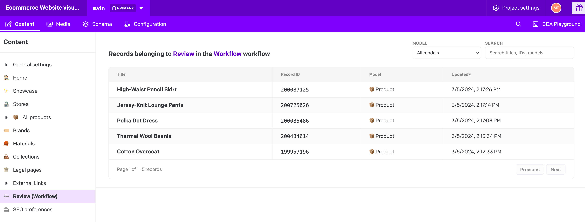

# Project Wide Stage Viewer

Surface every record currently sitting in a DatoCMS workflow stage—across every model—in one focused view.


<details>
<summary>Demo screenshot</summary>



</details>

## Table of contents

- [Highlights](#highlights)
- [Requirements](#requirements)
- [Installation](#installation)
  - [Install from the Marketplace](#install-from-the-marketplace)
  - [Install manually](#install-manually)
- [Configuration](#configuration)
- [Using the stage view](#using-the-stage-view)
- [Scripts & local development](#scripts--local-development)
- [Troubleshooting](#troubleshooting)
- [Contributing](#contributing)
- [License](#license)

## Highlights

- **Cross-model overview** – list every record currently assigned to a workflow stage, independent of model.
- **Context at a glance** – the header reminds editors which stage and workflow they are reviewing.
- **Precise filtering** – narrow results by model or full-text search across title, ID, and model name.
- **Fast sorting** – reorder by title, record ID, model name, or last update time in either direction.
- **Pagination built-in** – results are paged in chunks of 50 so large workflows stay readable.
- **One-click jump** – open a record in the DatoCMS editor directly from the table.
- **Responsive & accessible** – works inside the DatoCMS UI across screen sizes with keyboard navigation support.

## Requirements

- A DatoCMS project with workflows enabled.
- Permission to install and configure plugins in the target project.
- An access token with `currentUserAccessToken` capability (granted automatically when you install the plugin).

## Installation

### Install from the Marketplace

1. Log into DatoCMS and open **Settings → Plugins**.
2. Search for **Project Wide Stage Viewer** and click **Install**.
3. Confirm the required permissions when prompted.

### Install manually

1. Clone this repository or download the sources.
2. Install dependencies with:

   ```bash
   pnpm install
   ```

3. Build the plugin:

   ```bash
   pnpm build
   ```

   The compiled assets are generated in the `dist/` directory.

4. In DatoCMS open **Settings → Plugins → Add new plugin → From your computer** and upload the contents of `dist/` as a ZIP.

## Configuration

1. Open the plugin configuration screen inside DatoCMS.
2. Click **Add stage** and pick the workflow and stage you want to expose.
3. (Optional) Provide a custom label and icon to define how the stage appears inside the editorial sidebar.
4. Save the configuration. Each configured stage becomes a persistent entry in the content sidebar, pointing to the stage view page rendered by this plugin.

You can repeat the process to add as many workflow stages as you like—each is saved as a menu item inside the plugin parameters.

## Using the stage view

1. Navigate to the stage via the entry created in the content sidebar.
2. The header summarises the context: _“Records belonging to **Stage** in the **Workflow** workflow.”_
3. Use the **Model** dropdown to limit results to a single model, or leave it blank to see every model.
4. Use the **Search** field to filter records by title, record ID, or model name.
5. Click any column header to sort ascending/descending.
6. Page through the results 50 at a time with the minimalist **Previous** and **Next** controls.
7. Tap **Enter** or **Space** (or click) on a row to open the record in the standard DatoCMS editor.

If no matches are found, contextual empty states explain why (stage empty, filter mismatch, search mismatch, etc.).

## Scripts & local development

| Command | Description |
| --- | --- |
| `pnpm install` | Install dependencies. |
| `pnpm dev` | Start the Vite dev server (defaults to `http://localhost:5173`). Point your plugin instance to this URL for local development. |
| `pnpm build` | Type-check and bundle the production assets into `dist/`. |

When developing locally, configure the plugin in DatoCMS to load from your dev server by entering the dev URL in the plugin settings.

## Troubleshooting

- **No stages appear in the configuration screen** – ensure workflows are enabled in your DatoCMS plan and that the logged in user can read workflows.
- **Table is empty** – either no records are currently assigned to the stage, or applied filters/search exclude them. Clear filters or switch models to confirm.
- **Navigation fails** – the plugin uses `currentUserAccessToken`; make sure the user has permission to edit the target models.

## Contributing

1. Fork the repository and create a feature branch.
2. Run `pnpm dev` to work against a local build.
3. Run `pnpm build` before opening a pull request to ensure the bundle compiles cleanly.
4. Explain the change, add screenshots when UI changes are involved, and include any relevant testing notes.

## License

Released under the [MIT License](LICENSE).
