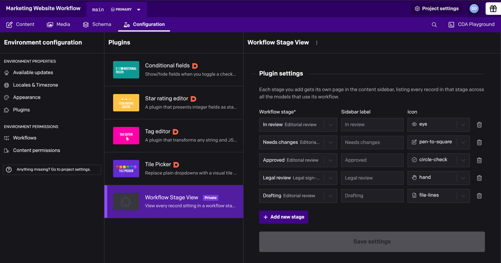
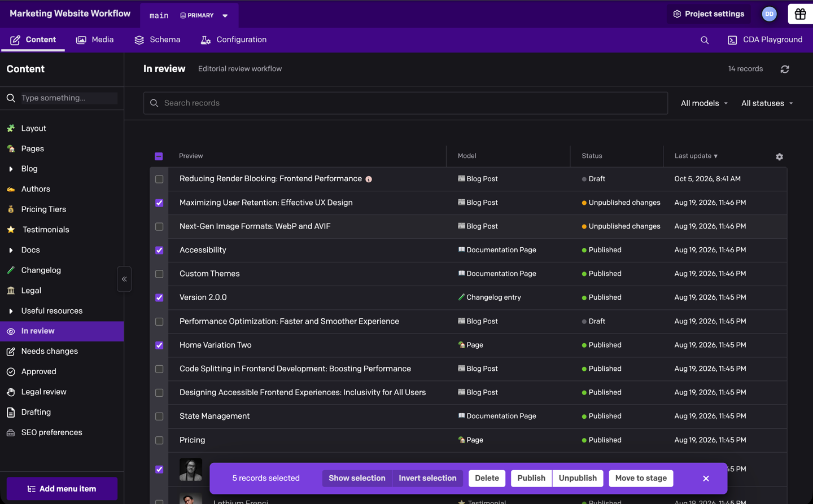

# Workflow Stage View

See every record waiting in a workflow stage, whatever its model, in one table. Pin the stages your team works from to the content sidebar, then review, publish, or move their records in bulk.


- **One page per stage**: each stage you pin gets its own entry in the content sidebar.
- **Every model in one table**: records from all the models that use the workflow, with the same preview, model, status and date columns as DatoCMS's own tables.
- **Search, filter and sort**: by title, model or record ID, by model, by publication status, and by any column.
- **Bulk actions across models**: publish, unpublish, delete, or move records to another stage of the workflow, even when they belong to different models.
- **Your permissions apply**: actions show only when your role allows them.

## Installation

1. Install **Workflow Stage View** from **Configuration → Plugins**.
2. When asked, let it use the current user's API token. The plugin reads and updates records as whoever is viewing the page, so everyone sees only what their role allows.
3. In the plugin settings, pick the stages to show in the sidebar (see below).

You need at least one workflow, assigned to at least one model. Create workflows in **Configuration → Workflows**, and assign one to a model in the model's settings.

## Choose the stages

The plugin settings decide which stages get a page in the content sidebar.



1. Click **Add new stage** and pick a stage. Stages are grouped by workflow.
2. Optionally give it a **Sidebar label** (the stage name is used otherwise) and an **Icon**.
3. Click **Save settings**.

Each stage appears in the content sidebar, in the order you added them. The trash button removes one. When two workflows have a stage with the same name, the workflow name is added to the label. Changing the settings requires permission to edit the schema; other users see them read-only.

## Browse a stage

Open a stage from the content sidebar. The header shows the stage, its workflow and how many records match your search and filters; the reload button fetches them again.

- Type in **Search records** to match titles, model names or record IDs, and use **All models** and **All statuses** to narrow the list.
- Click a column header to sort by it, and click again to reverse the order.
- The gear at the end of the header row adds, removes and reorders columns (**Created** and **ID** are available too). Drag a column's edge to resize it. The layout is remembered in your browser.
- Show 25, 50, 100 or 200 records per page.
- Click a row, or focus it and press Enter, to open the record.

Records with an image show its thumbnail. An icon after a title marks a record whose current or published version doesn't pass validation.

## Act on many records at once

Select records to act on them together, whatever their model.



1. Tick the records, or tick the header checkbox to select the whole page. **Select all matching records** extends the selection to every record that matches the search and filters.
2. Use **Show selection** to review what's selected, or **Invert selection** to flip it.
3. Pick **Delete**, **Publish**, **Unpublish** or **Move to stage**. Move to stage asks which stage of the workflow the records should go to.
4. Confirm. The dialog says how many of the selected records the action applies to.

Each action reads the selected records again right before it runs, so a record that was deleted or left the stage in the meantime is skipped. Records are processed in batches of up to 200, one model at a time when moving. With more than one batch, the bar shows the progress and **Cancel remaining** stops after the current batch. The table reloads when it's done.

## Good to know

- **Actions follow your role.** An action shows only when your role allows it for at least one selected record, and it applies to those records only. Publishing applies to models that use drafts.
- **Other plugins' hooks don't run.** Bulk actions go straight to the Content Management API, so plugins that check records before they're published or deleted in the editor aren't consulted.
- **The list is a snapshot.** Changes made elsewhere show up when you reload the page or click the reload button.
- **Only the stage's records are downloaded**, model by model, so the page stays quick on large projects.
- **Removed stages:** if a pinned stage or its workflow is deleted, its page says so. Remove it from the plugin settings.

## Development

From this directory:

```sh
npm ci
npm run dev       # serves the plugin at http://localhost:5173
npm run harness   # the screens with mock data at http://localhost:5287
npm test
npm run lint
npm run build
```

To try it in a project, add a private plugin whose entry point is `http://localhost:5173`. The harness accepts `?surface=page` or `?surface=config`, `&scheme=dark`, and `&data=empty|error|missing|slow|unknown` to review each state.

## License

Released under the [MIT License](LICENSE).
