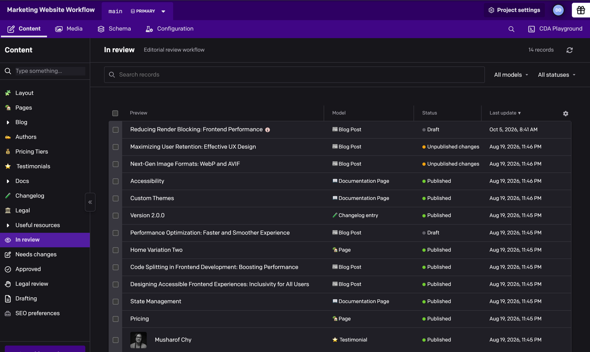

# Workflow Stage View

Lists every record in a workflow stage, whatever its model, in one table. Pin the stages your team works from to the content sidebar, then publish, unpublish, delete or move their records in bulk.



## Setup

You need at least one workflow assigned to a model. Create workflows in **Configuration → Workflows** and assign one in the model's settings.

Install **Workflow Stage View** from **Configuration → Plugins** and let it use the current user's API token. The plugin reads and updates records as whoever is viewing the page, so everyone sees and changes only what their role allows.

In the plugin settings, click **Add new stage**, pick a stage, optionally give it a sidebar label and an icon, and save. Each stage gets its own entry in the content sidebar. Only users who can edit the schema can change these settings.


## Usage

Open a stage from the content sidebar. You can search by title, model or record ID, filter by model and publication status, sort by any column and choose which columns to show. Click a row to open the record. An icon after a title marks a record that doesn't pass validation.

To act on several records, select them (**Select all matching records** goes beyond the current page) and choose **Publish**, **Unpublish**, **Delete** or **Move to stage**. An action applies only to the selected records your role allows it for, and publishing only applies to models that use drafts. Records that were deleted or left the stage since the page loaded are skipped.


## Caveats

Bulk actions go straight to the Content Management API, so other plugins that check records before they're published or deleted in the editor aren't consulted.

The table doesn't update live. Click the reload button to see changes made elsewhere.

If a pinned stage or its workflow is deleted, its page says so. Remove it from the plugin settings.

## Development

```sh
npm ci
npm run dev       # http://localhost:5173
npm run harness   # screens with mock data at http://localhost:5287
npm test
npm run lint
npm run build
```

To try it in a project, add a private plugin with `http://localhost:5173` as its entry point.

## License

Released under the [MIT License](LICENSE).
