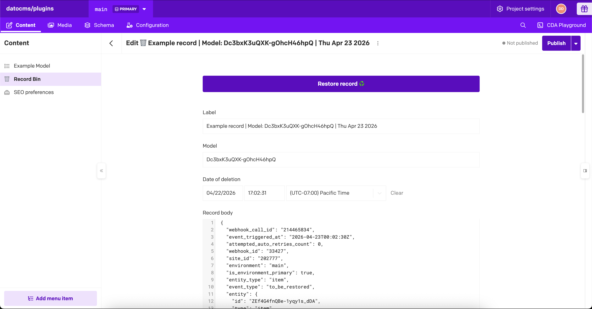

# 🗑 Record Bin



Record Bin will make a best-effort attempt to store a copy of deleted records in its own "Record Bin" model prior to deletion. These copies can then be restored to their original models later in case of an accidental deletion.

It works similarly to the trash can / recycling bin on your computer filesystem.

The plugin isn't foolproof (see the "Important limitations and behavior" section below) but should catch the majority of record deletions.

## Usage

When you install the plugin, it is automatically configured and should catch deletion events in your models.

To test it, create a draft record in any model, enter some fake content, and then save it. Then delete that same record.

Within a few seconds, you should see a new "Record Bin" model appear in the left sidebar, and a deleted copy of that record should appear within it.

Note that the deleted record will not look the same as it originally did, because the plugin stores it as a machine-readable JSON copy. But once you restore it to the original model, it should look the same again.

### How the basic mode works

The plugin uses [Event Hooks](https://www.datocms.com/docs/plugin-sdk/event-hooks) from the DatoCMS Plugins SDK to intercept record deletion events (specifically, `onBeforeItemsDestroy`). Right before the record is deleted, it makes a JSON copy and saves it to its own Record Bin model.

Upon restore, it uses that saved JSON to re-create the record in the original model.

## (Optional) Advanced usage: Also save records deleted from the API

Normally, per above, the plugin will catch record deletions done from within the CMS itself. That is where the plugin runs and the lifecycle event hooks occur. This should be fine for most projects.

However, the normal mode will NOT catch record deletions done via the Content Management API, outside of the CMS.

If you have developers, scripts, or integrations that may accidentally delete records via the API, you may wish to consider enabling this advanced mode in order to catch those deletions as well.

This mode takes a bit more setup, but is safer if you ever manipulate your project via API.

### How advanced (lambda) mode works

This advanced "lambda" mode will auto-configure some "on record delete" webhooks, coupled to external serverless functions on Vercel/Netlify/Cloudflare, in order to also catch these programmatic deletions from the API.

A lambda, also known as a serverless function, is just a simple script that can execute some API calls in response to our "on record delete" webhook. We need to host it on an external provider because DatoCMS doesn't host user-generated lambdas.

### Setup for the advanced mode (only)

(Again: You do not need this UNLESS you use the Content Management API to delete records, and also wish to protect against accidental deletions there.)

1. First, make sure you have an CMA API token with admin permissions. On older DatoCMS projects this was automatically created as a "Full Access Token", but you'll have to manually make one in newer projects.
2. Open the plugin config screen.
3. Expand the "Advanced settings" accordion.
4. Enable the `Also save records deleted from the API` toggle.
5. A Lambda setup section will then appear above the Advanced settings.
6. Click `Deploy lambda` and choose one option (Vercel, Netlify, or Cloudflare). This will clone our [lambda webhook functions](https://github.com/marcelofinamorvieira/record-bin-lambda-function) (written by DatoCMS employee Marcelo Finamor) into the provider of your choice.
7. Follow the setup instructions in that provider, including providing your CMA API token when requested.
8. Once deployment is complete, find the deployed URL and and copy it to your clipboard.
9. Go back to the plugin settings and paste that URL into the `Lambda URL` field.
10. Click `Connect` to test the configuration.
11. Confirm status shows `Connected (ping successful)`.

When connected, the plugin creates or updates a project webhook named `🗑️ Record Bin` pointing to your lambda function.
The current user role must be allowed to manage webhooks for connect/disconnect operations.

## Important limitations and behavior

- In Lambda-less mode, API-triggered deletions are not captured. Only dashboard-triggered deletions go to the bin.
- Lambda-less capture is NOT failsafe: Even if the backup fails, deletion WILL STILL OCCUR.
- Existing webhook-origin `record_body` payloads are still restorable.
- New Lambda-less payloads are stored in a webhook-compatible envelope (`event_type: to_be_restored`) so records stay restorable after runtime switches.

## For developers only: Additional technical details

### Lambda health handshake contract (Lambda runtime)

The plugin sends this request payload to `POST /api/datocms/plugin-health`:

```json
{
  "event_type": "plugin_health_ping",
  "mpi": {
    "message": "DATOCMS_RECORD_BIN_PLUGIN_PING",
    "version": "2026-02-25",
    "phase": "config_connect"
  },
  "plugin": {
    "name": "datocms-plugin-record-bin",
    "environment": "main"
  }
}
```

`phase` values:

- `config_connect` when the user clicks `Connect` on the config screen.
- `config_mount` every time the config screen is opened.
- `finish_installation` is legacy and kept for backward compatibility with older saved states.

Expected successful response (`HTTP 200`):

```json
{
  "ok": true,
  "mpi": {
    "message": "DATOCMS_RECORD_BIN_LAMBDA_PONG",
    "version": "2026-02-25"
  },
  "service": "record-bin-lambda-function",
  "status": "ready"
}
```

Any non-200 status, invalid JSON, timeout, network failure, or contract mismatch is treated as a connectivity error.

### Record Bin webhook contract (Lambda runtime)

On connect, the plugin reconciles a managed project-level webhook (creates if missing, updates if existing):

- `name`: `🗑️ Record Bin` (legacy `🗑 Record Bin` is migrated)
- `url`: connected lambda base URL
- `events`: `item.delete`
- `custom_payload`: `null`
- `headers`: `{}`
- `http_basic_user`: `null`
- `http_basic_password`: `null`
- `enabled`: `true`
- `payload_api_version`: `3`
- `nested_items_in_payload`: `true`

## Release history

See [CHANGELOG.md](CHANGELOG.md).
