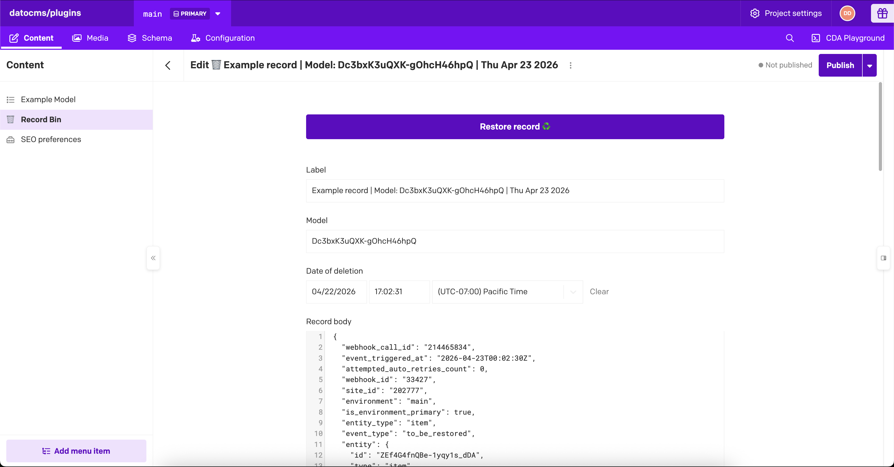

# 🗑 Record Bin

Keeps a copy of every record you delete in a "Record Bin" model, so you can restore it to its original model if it was deleted by mistake. It works like the trash can on your computer.



## Usage

Install the plugin. There's nothing to configure for records deleted from the dashboard.

To try it, create and save a record, then delete it. Within a few seconds a "🗑 Record Bin" model appears in the sidebar with a copy of that record. The copy is stored as JSON, so it won't look like the original. Open it and click **Restore record ♻️** to re-create it in its original model. If the restore fails, you'll see the API error and the copy stays in the bin.

Before a record is deleted, the plugin saves and verifies its copy. If that fails, the deletion is cancelled and the record is kept.

## Catching deletions made through the API

By default, only deletions made in the dashboard are caught. Records deleted through the Content Management API (by scripts, integrations or developers) are not. To catch those too, you can deploy a small serverless function that receives a "record deleted" webhook from DatoCMS. You don't need this unless you delete records through the API.

1. Create a CMA API token with admin permissions. Older projects have one already, called "Full Access Token".
2. Open the plugin's configuration screen, expand **Advanced settings** and turn on **Also save records deleted from the API**.
3. In the Lambda setup section that appears, click **Deploy lambda** and pick Vercel, Netlify or Cloudflare. This clones the [Record Bin lambda function](https://github.com/marcelofinamorvieira/record-bin-lambda-function) into your account.
4. Follow the provider's setup, giving it your CMA token when asked.
5. Copy the deployed URL, paste it into **Lambda URL** and click **Connect**. The status should read "Connected (ping successful)".

Connecting creates a project webhook called "🗑️ Record Bin" that points to your function, so your role needs permission to manage webhooks. In this mode the copy is made by the webhook after the record is deleted, so the plugin can't guarantee every deletion is captured.

## Limitations

The plugin blocks deletions of more than 200 records at once. Delete in smaller selections.

Each copy is a record in your project, so it counts toward your record quota. A record too large to fit in a single bin record can't be copied, and its deletion is cancelled.

Assets aren't copied, only referenced. Restoring a record needs its assets, linked records and model to still exist. Links pointing to the deleted record from other records are not put back on restore.

## Development

```bash
npm ci
npm run dev
npm run check
```

Release history is in [CHANGELOG.md](CHANGELOG.md).
