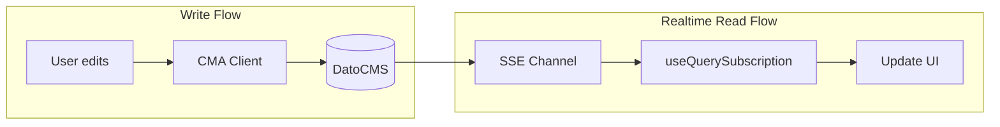

# Realtime Comments Updates

## Overview

Add realtime subscription to the comments sidebar so that when any user adds, edits, or deletes a comment, all other users viewing the same record will see the changes immediately without refreshing.

## Implementation Approach

Use `react-datocms`'s `useQuerySubscription` hook which provides a convenient wrapper around DatoCMS's Real-time Updates API (Server-Sent Events).

## Key Changes

| File | Change |

|------|--------|

| [package.json](package.json) | Add `react-datocms` dependency |

| [src/entrypoints/CommentsBar.tsx](src/entrypoints/CommentsBar.tsx) | Replace CMA polling with realtime subscription |

## Implementation Details

### 1. Add Dependency

```json
"react-datocms": "^7.0.0"
```

### 2. Refactor CommentsBar to use Realtime Subscription

The `useQuerySubscription` hook requires:

- A GraphQL query to fetch the `project_comment` record for the current model/record
- A read-only API token (available via `ctx.environment` in plugins)

The subscription will:

1. Query for `project_comment` records filtered by `model_id` and `record_id`
2. Automatically receive updates when the record changes
3. Update the local state when changes are detected from other users

### 3. Handling Local vs Remote Changes

To avoid conflicts between local edits and realtime updates:

- Track a "last saved" timestamp
- Only apply remote updates if they're newer than the last local save
- Continue using CMA client for writes (realtime is read-only)

## Architecture



## Notes

- The realtime API requires a read-only API token (Content Delivery API token)
- Plugins can access this via `ctx.environment` which contains the public API token
- The subscription automatically handles reconnection on network issues