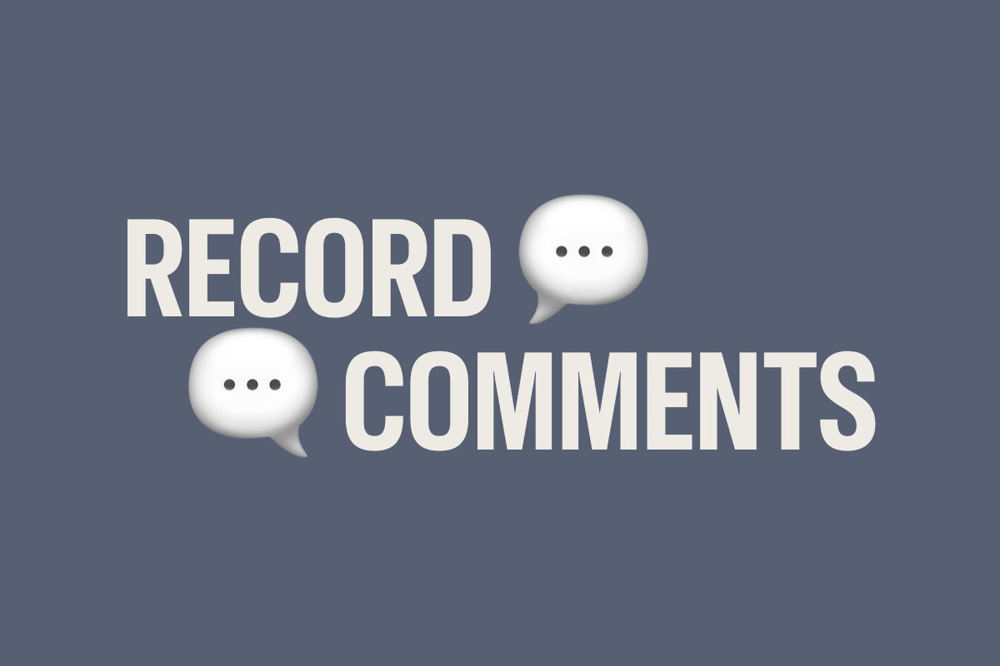

# Record Comments

A DatoCMS plugin that enables team collaboration through threaded comments on any record and a project-wide Comments Dashboard. Discuss content, leave feedback, mention teammates and assets, and keep conversations organized—all within your DatoCMS editing experience.



## Features

### Record Sidebar Comments
- **Add comments** to any record in your project
- **Threaded replies** for organized conversations
- **Upvote system** to highlight valuable feedback
- **Edit & delete** your own comments
- **Realtime updates** — see new comments instantly without refreshing
- **Gravatar integration** — automatic profile pictures for commenters
- **Rich text composer** — TipTap-based editor with mention support

### Project-Wide Comments Dashboard
- **Global comments channel** — Slack-style project-wide discussions accessible from the sidebar
- **My Mentions** — Quick access to comments where you've been @mentioned
- **Recent Comments** — See the latest activity across your entire project
- **Advanced filtering** — Filter comments by author, date range, mentioned records, assets, models, or users
- **Search** — Full-text search across all comments
- **Smart auto-scroll** — Automatic scrolling for new messages with an indicator when scrolled up

### Rich Mention System
Reference project content directly in your comments:

| Trigger | Type | Description |
|---------|------|-------------|
| `@` | User mentions | Tag team members to notify them |
| `#` | Field mentions | Reference specific fields (supports nested fields in modular content/structured text) |
| `&` | Record mentions | Link to other records (opens record picker) |
| `^` | Asset mentions | Reference media assets (opens asset picker) |
| `$` | Model mentions | Reference content models |

### User Profile Customization
- **Custom display names** — Override how your name appears in comments
- **Custom avatars** — Upload a profile picture to replace Gravatar
- Access via **Settings → Plugins → Record Comments → User Profiles**

## Demo

https://github.com/user-attachments/assets/demo.mp4

## Installation

1. Go to **Settings → Plugins** in your DatoCMS project
2. Click **Add new plugin**
3. Search for "Record Comments" in the marketplace
4. Click **Install**

The plugin automatically creates a `project_comment` model to store all comments. This keeps your content models clean while providing a centralized location for collaboration data.

## Configuration

### Setting up Realtime Updates

To enable realtime updates (seeing new comments instantly), provide a Content Delivery API (CDA) token:

1. Navigate to **Settings → API Tokens** in your DatoCMS project
2. Copy your **Read-only API token** (CDA token)
3. Go to the plugin settings (**Settings → Plugins → Record Comments**)
4. Paste your CDA token and click **Save Settings**

> **Note:** Without a CDA token, the plugin works but won't show realtime updates from other users.

### Realtime Updates Toggle

You can enable or disable realtime synchronization in the plugin settings. When disabled, you'll need to refresh to see new comments from other users.

## Usage

### Record Sidebar Comments

1. Open any record in your DatoCMS project
2. In the sidebar on the right, click the **Comments** panel to expand it
3. Type your message in the composer at the bottom
4. Use mention shortcuts or toolbar buttons to add rich references
5. Press **Enter** to send (or **Shift+Enter** for a new line)

> **Important:** You must save the record at least once before adding comments.

### Comments Dashboard

1. Click **Comments** in the left sidebar navigation (below the content area)
2. The main channel shows project-wide discussions
3. Use the filter button to search and filter comments
4. Check **My Mentions** to see where you've been tagged
5. Check **Recent Comments** to see the latest activity

### Adding Mentions

While composing a comment, you can add mentions in two ways:

**Using keyboard shortcuts:**
- Type `@` followed by a name to mention a user
- Type `#` followed by a field name to reference a field
- Type `&` to open the record picker
- Type `^` to open the asset picker
- Type `$` followed by a model name to reference a model

**Using the toolbar:**
Click the toolbar buttons below the composer to insert mentions.

### Nested Field Mentions

When mentioning fields with `#`, you can drill down into:
- **Modular content blocks** — Navigate through block models to reference nested fields
- **Structured text blocks** — Access fields within structured text block models
- **Localized fields** — Select the specific locale you want to reference

### Replying to Comments

Click the **reply icon** on any comment to add a threaded reply. Replies are nested under the parent comment for easy tracking.

### Upvoting Comments

Click the **upvote arrow** on any comment to show agreement or mark it as helpful. Click again to remove your upvote.

### Editing & Deleting

- Click the **pencil icon** to edit your comment
- Click the **trash icon** to delete your comment

You can only edit or delete comments you authored.

## How It Works

### Data Storage

Comments are stored in a dedicated `project_comment` model that is automatically created when the plugin is installed:

| Field | Description |
|-------|-------------|
| `model_id` | The ID of the model the commented record belongs to (or `__global__` for dashboard comments) |
| `record_id` | The ID of the record being commented on (unique), or `__project__` for dashboard comments |
| `content` | JSON array containing all comments and replies |

### Comment Structure

Each comment object contains:

```json
{
  "id": "550e8400-e29b-41d4-a716-446655440000",
  "dateISO": "2024-01-15T10:30:00.000Z",
  "content": [
    { "type": "text", "value": "This looks great! " },
    { "type": "mention", "mentionType": "user", "id": "jane@example.com", "label": "Jane" },
    { "type": "text", "value": " please review the " },
    { "type": "mention", "mentionType": "field", "id": "hero_section_title", "label": "Hero Title" }
  ],
  "author": {
    "name": "John Doe",
    "email": "john@example.com"
  },
  "usersWhoUpvoted": [
    { "name": "Jane Smith", "email": "jane@example.com" }
  ],
  "replies": []
}
```

### Realtime Subscriptions

When configured with a CDA token, the plugin uses DatoCMS's realtime GraphQL subscriptions to detect changes. When another user adds, edits, or deletes a comment, all viewers see the update instantly.

### Operation Queue & Conflict Resolution

The plugin uses a robust queue-based system for comment operations:

- **FIFO processing** — Operations are processed in order
- **Optimistic UI** — Changes appear instantly while syncing in background
- **Automatic retry** — Failed operations retry with exponential backoff
- **Conflict resolution** — Fetches fresh server state before each operation
- **Sync cooldown** — 8-second cooldown prevents subscription data from overwriting local changes

## Migration from Legacy System

If you previously used an older version of this plugin that stored comments in a `comment_log` JSON field on each model, you can migrate to the new centralized system:

1. Go to the plugin settings (**Settings → Plugins → Record Comments**)
2. Click **"Scan for Legacy Comments"** to find models with `comment_log` fields
3. Review the found models and click **"Start Migration"**
4. After migration completes, optionally delete the old `comment_log` fields using the cleanup tool

> **Warning:** Ensure no one is editing comments during migration to avoid data loss. The cleanup action is irreversible.

## Permissions

This plugin requires the `currentUserAccessToken` permission to:

- Create the `project_comment` model on first install
- Read and write comment records
- Identify the current user for authoring comments

Mention features respect user permissions:

| Mention Type | Required Permission |
|--------------|---------------------|
| Asset mentions | Upload/media permissions |
| Model mentions | Schema access |
| Record mentions | Read access to the model |
| User mentions | No special permission |
| Field mentions | No special permission |

## Troubleshooting

### Comments not appearing in realtime
- Ensure you've configured a CDA token in plugin settings
- Check that "Realtime Updates" is enabled
- Verify the CDA token has read access to the `project_comment` model

### Can't add comments to a record
- The record must be saved at least once before comments can be added
- Ensure you have write permissions for the project

### Mentions not working
- User mentions require the user to exist in the project
- Asset mentions require upload permissions
- Record mentions are filtered to models you can read

## Development

### Local Setup

```bash
# Clone the repository
git clone https://github.com/datocms/plugins.git
cd plugins/record-comments

# Install dependencies
npm install

# Start development server
npm run dev
```

### Building

```bash
npm run build
```

The built plugin will be in the `dist/` directory.

### Project Structure

```
src/
├── main.tsx                           # Plugin entry point, SDK hooks, model creation
├── constants.ts                       # Shared constants (model API key, global IDs)
├── entrypoints/
│   ├── CommentsBar.tsx                # Record sidebar panel component
│   ├── CommentsDashboard.tsx          # Project-wide comments dashboard page
│   ├── ConfigScreen.tsx               # Plugin settings & migration tools
│   ├── UserProfileSettings.tsx        # User profile customization page
│   ├── components/
│   │   ├── Comment.tsx                # Individual comment with replies
│   │   ├── CommentActions.tsx         # Edit/delete/reply/upvote buttons
│   │   ├── CommentContentRenderer.tsx # Renders text + mentions
│   │   ├── ComposerBox.tsx            # Comment input composer
│   │   ├── ComposerToolbar.tsx        # Mention buttons + send button
│   │   ├── tiptap/                    # TipTap rich text editor components
│   │   ├── UserMentionDropdown.tsx    # @user autocomplete
│   │   ├── FieldMentionDropdown.tsx   # #field autocomplete (with nested support)
│   │   ├── ModelMentionDropdown.tsx   # $model autocomplete
│   │   ├── RecordModelSelectorDropdown.tsx # &record model picker
│   │   ├── GlobalCommentsChannel.tsx  # Main dashboard chat channel
│   │   ├── MyMentionsSidebar.tsx      # Shows user's mentions
│   │   ├── RecentCommentsList.tsx     # Shows recent activity
│   │   ├── SearchFilterBar.tsx        # Filter controls
│   │   ├── FilterDropdown.tsx         # Individual filter dropdown
│   │   └── DateRangePicker.tsx        # Date range filter
│   ├── hooks/
│   │   ├── useMentions.ts             # Unified mention handling
│   │   ├── useOperationQueue.ts       # Queue-based state management
│   │   ├── useCommentsData.ts         # Comments loading & subscriptions
│   │   ├── useCommentActions.ts       # Comment CRUD operations
│   │   ├── useCommentFilters.ts       # Filter state & logic
│   │   ├── useProjectData.ts          # Load users, models, fields
│   │   └── ...                        # Additional specialized hooks
│   ├── contexts/                      # React contexts for state sharing
│   ├── types/
│   │   ├── comments.ts                # Comment type definitions
│   │   ├── mentions.ts                # Mention type definitions
│   │   └── operations.ts              # Queue operation types
│   ├── utils/
│   │   ├── tipTapSerializer.ts        # TipTap to CommentSegment conversion
│   │   ├── operationApplicators.ts    # Pure functions for state updates
│   │   └── ...                        # Additional utilities
│   └── styles/
│       ├── commentbar.module.css      # Sidebar styles
│       ├── comment.module.css         # Comment component styles
│       ├── dashboard.module.css       # Dashboard page styles
│       └── configscreen.module.css    # Config screen styles
└── utils/
    ├── helpers.ts                     # Gravatar, thumbnail utilities
    └── render.tsx                     # React DOM renderer
```

## Dependencies

| Package | Purpose |
|---------|---------|
| [`datocms-plugin-sdk`](https://www.npmjs.com/package/datocms-plugin-sdk) | DatoCMS plugin SDK |
| [`datocms-react-ui`](https://www.npmjs.com/package/datocms-react-ui) | DatoCMS React UI components |
| [`react-datocms`](https://www.npmjs.com/package/react-datocms) | React hooks for DatoCMS (realtime subscriptions) |
| [`@datocms/cma-client-browser`](https://www.npmjs.com/package/@datocms/cma-client-browser) | DatoCMS Content Management API client |
| [`@tiptap/react`](https://www.npmjs.com/package/@tiptap/react) | TipTap rich text editor |
| [`react-textarea-autosize`](https://www.npmjs.com/package/react-textarea-autosize) | Auto-resizing textarea |
| [`javascript-time-ago`](https://www.npmjs.com/package/javascript-time-ago) | Relative time formatting |
| [`md5`](https://www.npmjs.com/package/md5) | Gravatar hash generation |

## Support

- [DatoCMS Documentation](https://www.datocms.com/docs)
- [DatoCMS Community](https://community.datocms.com/)
- [Report Issues](https://github.com/datocms/plugins/issues)

## License

MIT
