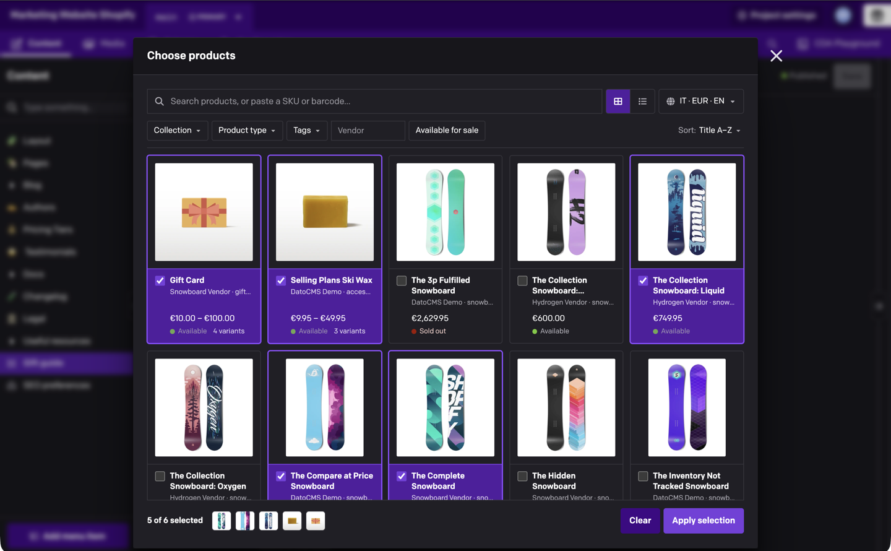
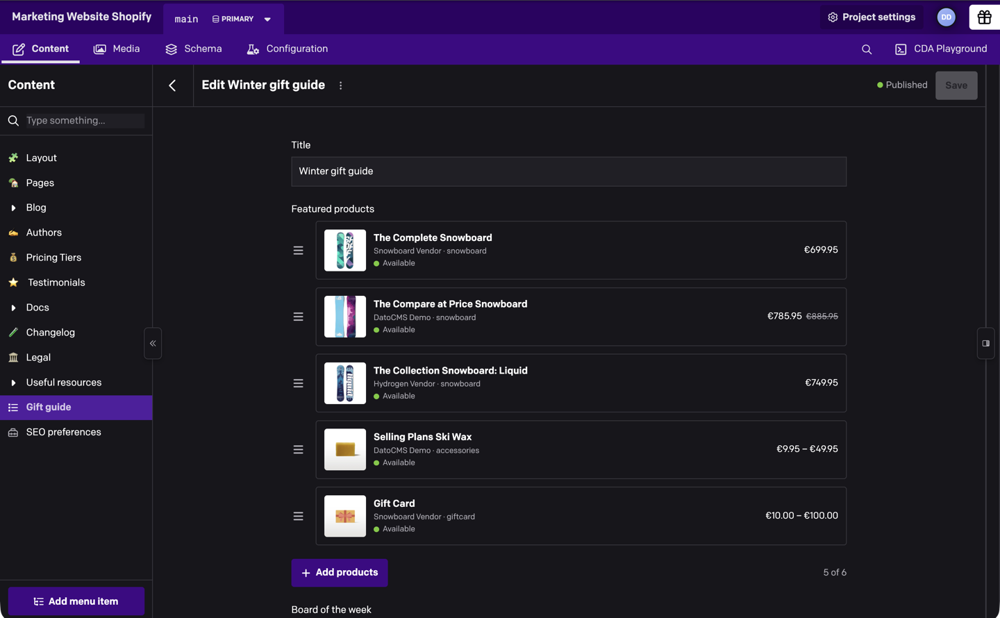

# Shopify product

Lets editors pick Shopify products, variants or collections in a DatoCMS field. The field saves a stable reference, and your frontend loads live prices, stock and images from Shopify.



## Connect your store

Install **Shopify product** from **Configuration → Plugins**. To try it without a store, turn on **Use the demo store?** under **Advanced settings** in the plugin settings. To connect your own store, you need the public Storefront API token of a Headless storefront.

1. In your Shopify admin, install the free [Headless](https://apps.shopify.com/headless) channel (it needs the **Apps and channels** staff permission), open it and click **Create storefront**.
2. Copy the storefront's **Public access token**. The plugin refuses private and Admin API tokens (`shpat_…`), because every editor can read its settings.
3. Next to **Storefront API permissions**, click **Edit** and allow reading products, variants and collections. Reading product tags (for the Tags filter) and product inventory (for stock counts) is optional.
4. Publish the products and collections editors should pick to that storefront. A new Headless storefront starts empty.
5. In the plugin settings, enter the **Shop domain** (`acme`, `acme.myshopify.com` or a Shopify admin URL) and the token, then click **Save settings**. The plugin tests the connection before saving.

If you change the permissions in Shopify later, click **Re-check** and save again. Storefront API tokens from custom apps created before 2026 also work.

**More options** sets the default country and language for prices and titles. **Advanced settings** lets you add more stores and auto-apply the plugin to fields whose API key matches a regular expression.

## Add a Shopify field

Add a **Single-line string** or **JSON** field and choose **Shopify** as the field editor in its **Presentation** tab. Then choose what editors pick and what the field stores: a reference document on JSON fields (recommended), the handle or Shopify ID on string fields, or the 1.x product JSON. A reference document can hold one item or an ordered list, optionally with a snapshot of each item's title, image and price. You can also limit choices by collection, product type, vendor, tag or availability. **Stored value example** shows exactly what the field will save.


## Usage

Editors click **Browse Shopify** to search, filter and pick from your catalog. Typing a full SKU or barcode shows the exact match first.

In the record, each item shows its image, price and availability. The field never changes a saved value on its own. When an item is unpublished or deleted, its handle changes, or the field's stored format changes, it shows a warning with an action to fix it.



## For developers

A reference document stores each item's Shopify ID and handle in the editor's order (variants also store `productId` and `productHandle`):

```json
{
  "version": 1,
  "shop": "acme.myshopify.com",
  "kind": "product",
  "references": [
    { "id": "gid://shopify/Product/10080752009562", "handle": "the-complete-snowboard" }
  ]
}
```

Query the field from DatoCMS, then load live data with the Storefront API `nodes(ids:)` query. The [developer guide](https://github.com/datocms/plugins/blob/master/shopify-product/docs/developer-guide.md) covers every stored format, with frontend and Hydrogen examples and a list of [error messages](https://github.com/datocms/plugins/blob/master/shopify-product/docs/developer-guide.md#connection-and-request-errors).

## Upgrading from 1.x

Existing fields keep storing the handle or the 1.x product JSON, so your frontend keeps working. To move a field to a new format, update your frontend to read both, then change the field's settings. Each record switches when an editor opens it and clicks **Convert to new format**. Fields auto-applied by API key keep the 1.x defaults.

If your code followed the 1.x README, `id` in the legacy product JSON is a Shopify GID (sometimes base64-encoded), not a numeric ID. See [Migrating from 1.x](https://github.com/datocms/plugins/blob/master/shopify-product/docs/developer-guide.md#migrating-from-1x).

## Limitations

Drafts, archived and scheduled products, and anything not published to the token's storefront, can't be picked or displayed. Field limits guide editors in DatoCMS but don't block saving, and the Content Management API and imports bypass them. Filtering inside a collection needs the matching filters enabled in Shopify's Search & Discovery app. The plugin has no server, so it can't sync products into records or react to Shopify webhooks.

## Development

```sh
npm ci
npm run dev
npm run harness
npm test
npm run lint
npm run build
```

## Changelog

### 2.0.1

Shorter README.

### 2.0.0

A rebuild adding variants, collections, lists, new stored formats, a new picker and multiple stores. Existing fields keep working as before; see [Upgrading from 1.x](#upgrading-from-1x).

### 1.0.10

New selections save the full-size `imageUrl` plus a 200x200 `previewImageUrl`. Existing values aren't rewritten.
