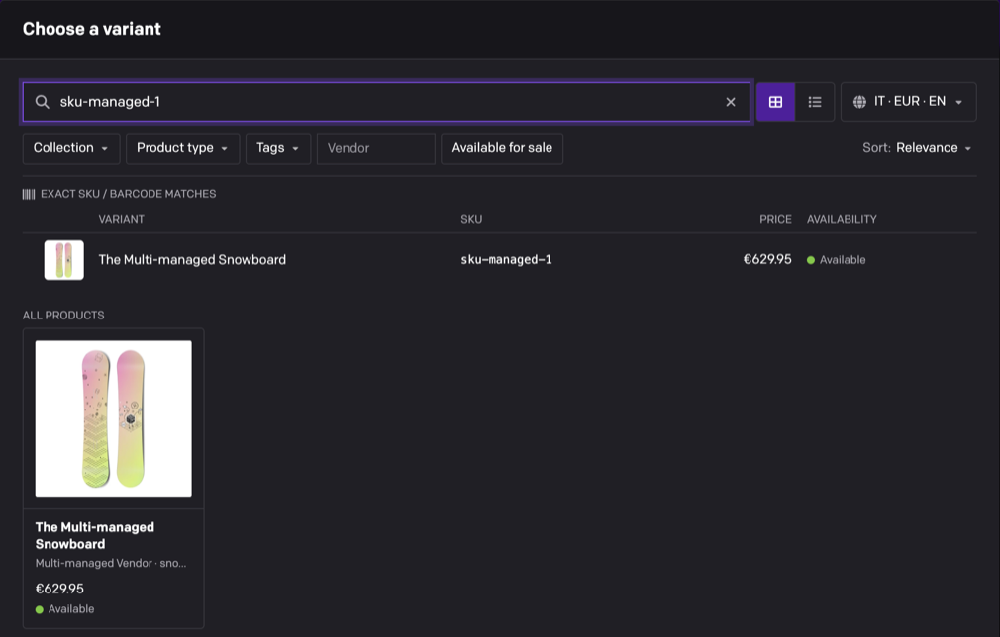
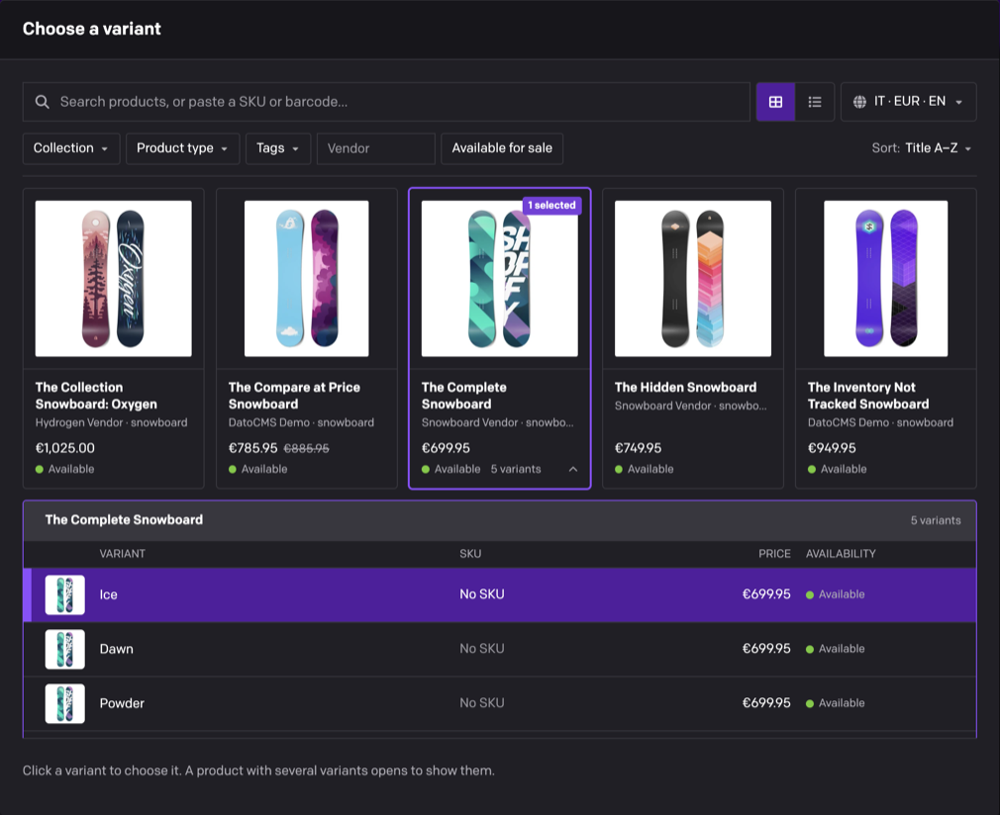

# Shopify product

Pick Shopify products, variants and collections right inside DatoCMS. Editors search your catalog by title, SKU or barcode, and the field saves a stable reference your frontend turns into live prices, stock and images.


- **Products, variants and collections**, one per field or as an ordered list
- **Find anything**: search by title, SKU or barcode, filter by collection, product type, tag, vendor or availability, and sort
- **Live rows in the editor** with images, prices and availability, straight from Shopify
- **Stable references** that survive renamed handles, in a documented, versioned format
- **Several stores per project**, each with its own default market
- **1.x fields keep working** exactly as before

## Installation

Install **Shopify product** from **Configuration → Plugins**, then connect your store as described below. To try it first, open the plugin settings, expand **Advanced settings**, switch on **Use the demo store?** and click **Save settings**: editors can then browse a sample snowboard catalog.

## Connect your Shopify store

The plugin runs in the editor's browser and reads your store through Shopify's **Storefront API**, with the **public** access token of a Headless storefront. It sees exactly what your storefront shows shoppers, and nothing else.

1. In your Shopify admin, install the free [Headless](https://apps.shopify.com/headless) channel by Shopify (it needs the **Apps and channels** staff permission), open it and click **Create storefront**.
2. Copy the storefront's **Public access token**. Never use the private token or an Admin API token (`shpat_…`): every editor's browser can read plugin settings, so the plugin refuses them.
3. Next to **Storefront API permissions**, click **Edit**, tick the permissions below and save.
4. Publish the products and collections editors should pick to that storefront. Each Headless storefront publishes its own products, so a new one starts empty.
5. In the plugin settings, enter the **Shop domain** (`acme`, `acme.myshopify.com` or a Shopify admin URL all work) and the token, then click **Save settings**. The plugin tests the connection and checks which optional permissions the token has before it saves.

| Permission | Needed | What it unlocks |
|---|---|---|
| Read products, variants, and collections | **Required** | Everything: browsing, search, variants, collections and live rows |
| Read product tags | Optional | The **Tags** filter in the picker and the tags limit in field settings |
| Read product inventory | Optional | Stock counts, such as "12 in stock" |


After you change permissions in Shopify, click **Re-check**, then **Save settings** so editors get the change. Storefront API tokens from custom apps created before 2026 keep working too.

## Plugin settings

- **More options**, under each store: **Connect without a token?** for public stores (it can't read tags or inventory, and fails on password-protected and development stores), and the **Default country** and **Default language** used for prices and titles in the editor.
- **Advanced settings**: **Add another store** (each field then picks which store it uses), **Use the demo store?**, and **Auto-apply to fields whose API key matches**, a regular expression that turns the plugin on for matching string and JSON fields with the 1.x defaults. Fields you set up manually keep their own settings.

## Add a Shopify field

Add a **Single-line string** or **JSON** field, open its **Presentation** tab and choose **Shopify** as the field editor. Then choose:

- **Editors pick**: products, product variants or collections.
- **Stored value**: a **Reference document** (JSON fields, recommended), the **Handle** or **Shopify ID** (string fields), or the **Legacy product JSON** that 1.x stored.
- **How many** (reference documents): one, or several in a drag-to-reorder list, with an optional minimum and maximum. The other formats hold one item.
- **Include a display snapshot?** (reference documents) to also save the title, image and price at selection time.
- **Limit choices** to a collection, product type, vendor, tags or products available for sale. Editors see these as locked filters.


Under the settings, **Stored value example** shows exactly what the field will save, so you can build your frontend against it.


## Pick products

Editors click **Browse Shopify** (or **Add products** on a field that already has some) to open the picker.

- **Search** matches the start of words in titles, vendors, product types, tags and SKUs. Typing a full SKU or barcode pins it under **Exact SKU / barcode matches**.
- **Filter and sort** with the bar under the search, switch between **Grid view** and **List view**, and pick the market prices are shown in.
- In fields that take several items, a tray at the bottom starts with the field's current items and collects your picks. **Apply selection** saves the tray as the field's value, in order and up to its maximum, so anything you remove from the tray, or **Clear**, leaves the field.



In variant fields, a product opens to list its variants with their options, SKU, price and availability. Click one to pick it.



## In the record

Each picked item shows its image, title, vendor and type, availability and price, with compare-at prices struck through. Drag the handles to reorder a list.


Hover an item for its actions: **Open in Shopify admin**, **Replace** and **Remove**, plus **View on store** when the item is published to your Online Store.


The field never changes a saved value on its own, and it tells editors when something needs attention:

- **Not visible to the storefront**: the item was unpublished from the Headless channel, archived or deleted. **Replace** or **Remove** it.
- **The Shopify handle changed**: **Update** saves the new handle in this record.
- **Shopify data changed since this was saved** (1.x product JSON): **Refresh saved data** updates the copy.
- **Saved as a Shopify handle. This field now saves a reference document.** (or another pair of formats) after a developer changed the field's settings: **Convert to new format** re-saves this record's value.

## For developers

A reference document field stores a versioned JSON value with each item's Shopify ID and handle (variants store their product's ID and handle as `productId` and `productHandle`), in the editor's order:

```json
{
  "version": 1,
  "shop": "acme.myshopify.com",
  "kind": "product",
  "references": [
    { "id": "gid://shopify/Product/10080752009562", "handle": "the-complete-snowboard" }
  ]
}
```

Query the field from DatoCMS, then load live data with the Storefront API `nodes(ids:)` query. The [developer guide](https://github.com/datocms/plugins/blob/master/shopify-product/docs/developer-guide.md) documents every stored format (handle, Shopify ID, reference document and legacy product JSON), with frontend code, Hydrogen examples and how to read old and new formats during a transition.

## Upgrading from 1.x

Nothing changes until you decide it should. Existing fields keep storing the product handle or the 1.x product JSON, and your frontend keeps working. The plugin settings move to the new format the first time someone who can edit the schema opens the project. To use the new formats, update your frontend to read both, then change the field's settings: records switch one at a time, when an editor converts them. See [Migrating from 1.x](https://github.com/datocms/plugins/blob/master/shopify-product/docs/developer-guide.md#migrating-from-1x).

## Good to know

- **Only what your storefront shows.** Drafts, archived and scheduled products, and products not published to the token's storefront, can't be picked or displayed.
- **Filters inside a collection** need the matching filters enabled in Shopify's Search & Discovery app; the picker disables the others with a hint.
- **Field limits guide editors.** In the DatoCMS editor, editors can't pick past the maximum or outside the limit choices, and see a warning below the minimum. The limits don't block saving, and the Content Management API and imports bypass them.
- **Search inside a collection or tag is narrower.** With a collection or tag filter applied, including a field's locked limits, SKU and barcode matches are off, and inside a collection search only matches titles, vendors, product types and handles.
- **No server involved.** The plugin can't sync products into records, react to Shopify webhooks or use private tokens.
- **Errors explain themselves.** Every failure shows what went wrong and how to fix it; the [developer guide](https://github.com/datocms/plugins/blob/master/shopify-product/docs/developer-guide.md#connection-and-request-errors) lists them all.

## Development

From this directory:

```sh
npm ci
npm run dev
npm test
npm run lint
npm run build
```

Connect the development URL to a test project using the [DatoCMS plugin development workflow](https://www.datocms.com/docs/plugin-sdk/build-your-first-plugin). `npm run harness` opens a local preview of every screen and state.

## Changelog

### 2.0.0

A rebuild of the plugin. Existing fields keep their 1.x behaviour and stored values until you change their settings.

- Pick products, product variants or collections, one per field or as an ordered list with an optional minimum and maximum.
- New stored formats: Shopify ID for string fields, and a versioned reference document for JSON fields, with an optional display snapshot.
- Per-field settings with a live stored value example, and limits editors see as locked filters.
- New picker: search with SKU and barcode matches, filters, sorting, paging through the whole catalog, grid and list views, variants and a market switcher.
- Live rows in the editor, with formatted prices, availability, admin and storefront links, drag to reorder, and recoverable states for unavailable, renamed, outdated and mismatched values.
- Several stores per project, each with a default market.
- Storefront API pinned to `2026-10`, set up through the Shopify Headless channel with a connection test and permission check. Admin API tokens are refused.
- A specific message for every error, and a per-store cache that replaces the shared 1.x cache.
- Matches the DatoCMS dashboard in light and dark mode, with keyboard and screen reader support.
- New marketplace preview video.

Upgrade notes:

- No action is needed: your content, field values and frontend keep working.
- Fields auto-applied by API key keep the 1.x defaults. A matching field you set up with the plugin manually keeps its own settings.
- If your code followed the 1.x README, `id` in the legacy product JSON is a Shopify GID (sometimes base64-encoded), not a numeric ID.

### 1.0.16

- Fixed minor typo

### 1.0.10

- New selections save full-size `imageUrl` plus `previewImageUrl` for the 200x200 preview. Existing JSON field values are not rewritten; reselect products or update stored JSON to refresh old `_200x200` `imageUrl` values.
