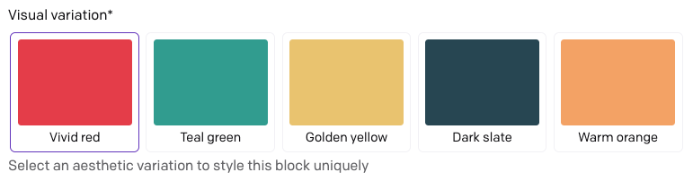
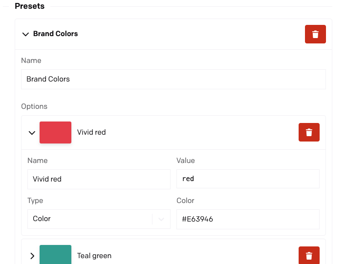
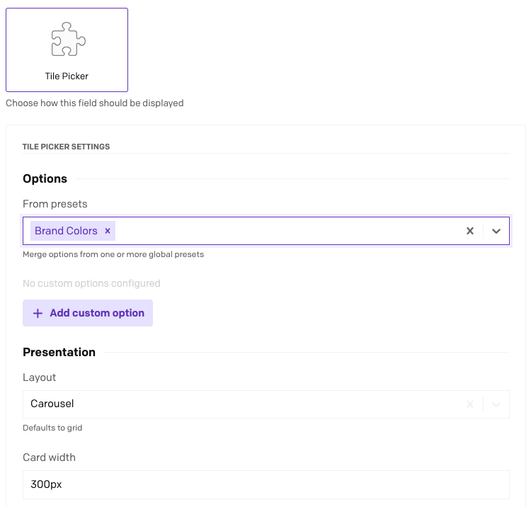

# Tile Picker

Replace plain string fields with a visual tile grid — pick from color swatches, image thumbnails, or any mix of both.

## Getting started

Add a `string` field to any model or block, and under the **Presentation** tab change the editor from "Text input" to **Tile Picker**. Then open the field's **Config** tab to configure its options.

## Global presets

If you plan to reuse the same set of options across multiple fields, define **presets** once under **Settings › Plugins › Tile Picker** rather than repeating the configuration on every field.

Each preset is a named collection of options. Give it a short, descriptive name (e.g. `Brand Colors`, `Page Layouts`) — once fields in production reference a preset, renaming it will break those references, so it is worth settling on a name early.

## Field configuration

Each field can draw its options from three sources, applied in order:

1. **Presets** — select one or more global presets; their options are merged in the order listed.
2. **Custom options** — options defined directly on the field, appended after any preset options.

This means a field can fully rely on presets, fully define its own options, or combine both — for example, pulling in `brandColors` and then appending a one-off "Custom" tile specific to that field.

The **value** stored in DatoCMS when an editor picks a tile is the option's **Value** field, not its display name. Keep values stable: renaming a value after content has been saved will leave existing records pointing to a tile that no longer exists.

Each option also has a **Layout** section where you can switch between a fixed-column **grid** (good for large sets) and a horizontally scrolling **carousel** (good for wide tiles or image thumbnails).

