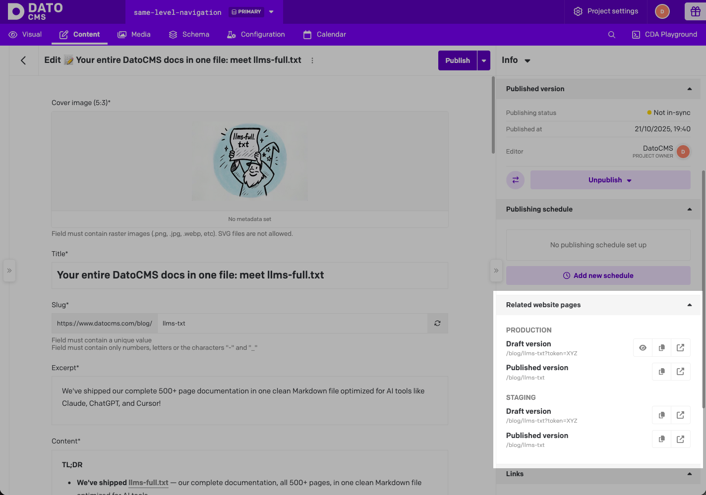
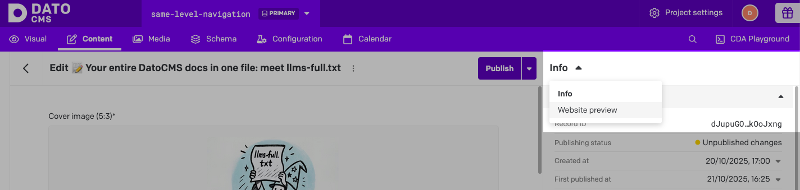
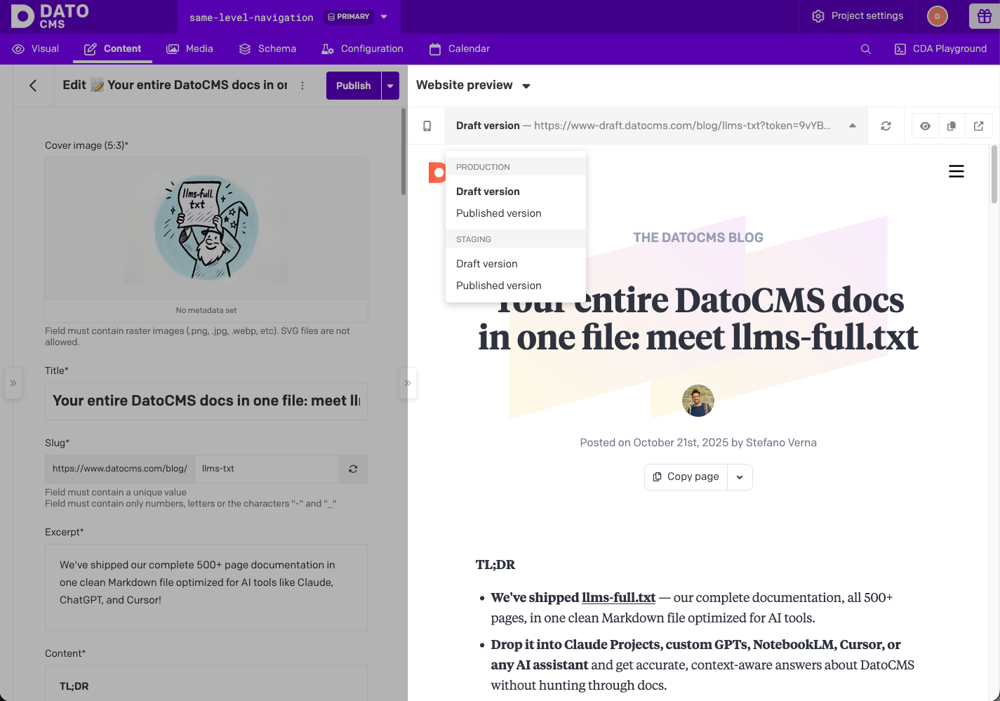

# Web Previews DatoCMS plugin

The plugin adds several touchpoints to the DatoCMS UI:

- **A "Visual" tab in the main navigation**: a full-screen, side-by-side editing view where the website preview sits next to the editing panel. Editors click on any element in the preview, and the corresponding record and field open right there. The tab includes:
  - An address bar for navigating the preview
  - Viewport controls for testing responsive layouts
  - A frontend selector for switching between environments (e.g. production vs. staging)

- **Preview links in the record sidebar**: when editors open any record, they see quick links to view that content on the actual website. The plugin determines which URL corresponds to each record by calling an API endpoint on your frontend.

- **A full iframe preview in the sidebar**: beyond just links, editors can expand an inline preview of the page directly in the sidebar, with viewport presets (mobile, tablet, desktop) and auto-reload on save.

The plugin supports **multiple frontends**, so if your content powers different websites or environments, editors can switch between them from a single dropdown.

Each feature can be enabled independently per frontend — they work great together, but each is useful on its own.

> **Important:** This plugin requires configuration and development work. You'll need to implement API endpoints on your frontend website(s) for it to function. Read more in the following sections.

## Installation and configuration

Once the plugin is installed, you'll see four configuration sections:

### 1. Frontends

Configure your project's frontends and the features each provides (e.g., "Production", "Staging", "Marketing Site"). For each frontend, you can enable:

#### Feature 1: Preview Links

When enabled, the plugin calls your API endpoint to retrieve preview URLs for the current record. You can then control how these links are displayed in the Record Sidebar (see section below).

**Required configuration:**
- **API endpoint URL** — The endpoint that returns preview links (e.g., `https://yourwebsite.com/api/preview-links`)
- **Custom Headers (Optional)** — Additional headers to send with the API request

#### Feature 2: Visual Editing

When enabled, editors can open a full-screen, side-by-side view with click-to-edit overlays on your actual website. Visual Editing shows your website in an iframe and adds interactive editing capabilities.

**Required configuration:**
- **Enable Draft Mode route** — The route that enables draft/preview mode (e.g., `https://yourwebsite.com/api/draft`). This route receives a `redirect` query parameter with the path to load.
- **Initial Path (Optional)** — The default path to load when opening Visual Editing (defaults to `/` if not specified)

#### Valid configurations per frontend

- ✅ **Only Preview Links** — Sidebar with preview URLs (optionally shown as links or in an iframe)
- ✅ **Only Visual Editing** — Direct access to full-screen side-by-side editing with overlays
- ✅ **Both features together** — Full integration with sidebar preview links and visual editing

#### Multiple frontends support

You can configure multiple frontends, each with their own combination of features. When multiple frontends have Visual Editing enabled, a frontend selector dropdown appears in the Visual Editing toolbar, allowing editors to switch between different environments.

### 2. Record Sidebar display settings

Configure display options for preview links shown in a DatoCMS record sidebar. When Preview Links is enabled for at least one frontend, you can control how the preview URLs are displayed:

#### Sidebar Panel
**Toggle:** Enable Sidebar Panel

Shows a small panel in the record sidebar with quick links to preview URLs. Links open in a new browser tab when clicked.



**Optional settings:**
- **Start with the panel open by default** — The panel will be expanded when users open a record

#### Full Preview Sidebar
**Toggle:** Enable Full Preview Sidebar

Shows a full sidebar with an iframe preview of the selected URL. This provides a side-by-side view of your website directly within DatoCMS.





**Optional settings:**
- **Default sidebar width (px)** — The initial width when the sidebar is opened

**Note:** Both the Sidebar Panel and Full Preview Sidebar can be enabled together. The Full Preview Sidebar shows the same URLs returned by your API endpoint, but renders them in an iframe for in-app preview.

### 3. Custom viewports

Configure viewport size presets for testing different screen sizes in iframe previews. Define custom viewport dimensions (name, width, height, icon) to quickly test responsive layouts.

### 4. Iframe Security Settings

Configure iframe permissions and security settings:

- **Iframe `allow` attribute** — Defines what features will be available to the `<iframe>` pointing to the frontend (e.g., access to microphone, camera). [Learn more](https://developer.mozilla.org/en-US/docs/Web/HTML/Element/iframe#allow)

## Content Security Policy

⚠️ For side-by-side previews to work, if your website implements a [Content Security Policy `frame-ancestors` directive](https://developer.mozilla.org/en-US/docs/Web/HTTP/CSP), you need to add `https://plugins-cdn.datocms.com` to your list of allowed sources:

```
Content-Security-Policy: frame-ancestors 'self' https://plugins-cdn.datocms.com;
```

## The Preview Links API endpoint

Each frontend must implement a CORS-ready JSON endpoint that, given a specific DatoCMS record, returns an array of preview link(s).

The plugin performs a POST request to the Preview Links API endpoint URL, passing a payload that includes the current environment, record and model:

```json
{
  "item": {…},
  "itemType": {…},
  "currentUser": {…},
  "siteId": "123",
  "environmentId": "main",
  "locale": "en",
}
```

- `item`: [CMA entity](https://www.datocms.com/docs/content-management-api/resources/item) of the current record
- `itemType`: [CMA entity](https://www.datocms.com/docs/content-management-api/resources/item-type) of the model of the current record
- `currentUser`: CMA entity of the [collaborator](https://www.datocms.com/docs/content-management-api/resources/user), [SSO user](https://www.datocms.com/docs/content-management-api/resources/sso-user) or [account owner](https://www.datocms.com/docs/content-management-api/resources/account) currently logged in
- `siteId`: the ID of the current DatoCMS project
- `environmentId`: the current environment ID
- `locale`: the locale currently active on the form

The endpoint is expected to return a `200` response, with the following JSON structure:

```json
{
  "previewLinks": [
    {
      "label": "Published (en)",
      "url": "https://mysite.com/blog/my-article"
    },
    {
      "label": "Draft (en)",
      "url": "https://mysite.com/api/preview/start?slug=/blog/my-article"
    }
  ]
}
```

The plugin will show all the preview links that are returned. If you want to make sure that a preview's URL is reloaded after each save, you can include an extra option (please be aware that because of cross-origin iframe issues, maintaining the scroll position between reloads will not be possible):

```json
{
  "label": "Draft (en)",
  "url": "https://mysite.com/api/preview/start?slug=/blog/my-article",
  "reloadPreviewOnRecordUpdate": { "delayInMs": 100 }
}
```

## The Enable Draft Mode route

When Visual Editing is enabled, your frontend must implement a route that enables draft/preview mode and redirects to the requested page. This route is called whenever the Visual Editing iframe needs to load a page in draft mode.

The plugin takes the Enable Draft Mode route URL from your configuration and adds a `redirect` query parameter to it:

- `redirect`: The relative path to redirect to after enabling draft mode (e.g., `/blog/my-article`, `/products/shoes`)

**Important:** The plugin preserves any existing query parameters in your configured URL. For example, if you configure the route as `https://yourwebsite.com/api/draft?token=secret123`, the plugin will call `https://yourwebsite.com/api/draft?token=secret123&redirect=/blog/my-article`. This allows you to include authentication tokens or other parameters in your configured URL.

The `redirect` parameter contains the path to load, NOT the full URL. Your route should validate that it's a relative path to prevent open redirect vulnerabilities.

### Expected behavior

1. **Validate authentication** (if needed) — If you included a token or other auth parameters in your configured URL, verify them
2. **Validate the redirect path** — Ensure the `redirect` parameter is a relative URL (not an absolute URL) to prevent open redirect attacks
3. **Enable draft/preview mode** — Set the appropriate cookies or session data to enable your framework's draft mode
4. **Redirect to the requested path** — Redirect the user to the path specified in the `redirect` parameter

### Example

If you configure the Enable Draft Mode route as:
```
https://yourwebsite.com/api/draft?token=your-secret-token
```

And Visual Editing opens with the path `/blog/my-article`, the plugin will make a request to:
```
GET https://yourwebsite.com/api/draft?token=your-secret-token&redirect=/blog/my-article
```

Your route should:
1. Validate the token matches your environment variable
2. Verify `/blog/my-article` is a relative path
3. Enable draft mode (set cookies, etc.)
4. Redirect to `/blog/my-article`

The browser will then load `/blog/my-article` with draft mode enabled, showing unpublished content in the Visual Editing iframe.

## Implementation examples

If you have built alternative endpoint implementations for other frameworks/SSGs, please open up a PR to this plugin and share it with the community!

### Next.js

We suggest you look at the code of our [official Starter Kit](https://github.com/datocms/nextjs-starter-kit):

* Route handler for the Preview Links API endpoint: [`app/api/preview-links/route.tsx`](https://github.com/datocms/nextjs-starter-kit/blob/main/src/app/api/preview-links/route.tsx)
* Enable Draft Mode route (and optional disable route) for Next.js [Draft Mode](https://www.datocms.com/docs/next-js/setting-up-next-js-draft-mode): [`app/api/draft-mode/enable/route.tsx`](https://github.com/datocms/nextjs-starter-kit/blob/main/src/app/api/draft-mode/enable/route.tsx) and [`app/api/draft-mode/disable/route.tsx`](https://github.com/datocms/nextjs-starter-kit/blob/main/src/app/api/draft-mode/disable/route.tsx)

The preview link URLs also include a `token` query parameter that the plugin would send to the API endpoint, like `https://www.mywebsite.com/api/preview-links?token=some-secret-ish-string`. The `token` is a string of your choice that just has to match in both the plugin settings and [in your frontend's environment variables](https://github.com/datocms/nextjs-starter-kit/blob/main/src/app/api/preview-links/route.tsx#L31-L34). While not encryption, this token is an easy way to limit access to your preview content.

### Nuxt

We suggest you look at the code of our [official Starter Kit](https://github.com/datocms/nuxt-starter-kit):

* Route handler for the Preview Links API endpoint: [server/api/preview-links/index.ts](https://github.com/datocms/nuxt-starter-kit/blob/main/server/api/preview-links/index.ts)
* Enable Draft Mode route (and optional disable route): [`server/api/draft-mode/enable.ts`](https://github.com/datocms/nuxt-starter-kit/blob/main/server/api/draft-mode/enable.ts) and [`server/api/draft-mode/disable.ts`](https://github.com/datocms/nuxt-starter-kit/blob/main/server/api/draft-mode/disable.ts)

The preview link URLs also include a `token` query parameter that the plugin would send to the API endpoint, like `https://www.mywebsite.com/api/preview-links?token=some-secret-ish-string`. The `token` is a string of your choice that just has to match in both the plugin settings and [in your frontend's environment variables](https://github.com/datocms/nuxt-starter-kit/blob/main/server/api/preview-links/index.ts#L42-L44). While not encryption, this token is an easy way to limit access to your preview content.

### SvelteKit

We suggest you look at the code of our [official Starter Kit](https://github.com/datocms/sveltekit-starter-kit):

* Route handler for the Preview Links API endpoint: [`src/routes/api/preview-links/+server.ts`](https://github.com/datocms/sveltekit-starter-kit/blob/main/src/routes/api/preview-links/%2Bserver.ts)
* Enable Draft Mode route (and optional disable route): [`routes/api/draft-mode/enable/+server.ts`](https://github.com/datocms/sveltekit-starter-kit/blob/main/src/routes/api/draft-mode/enable/%2Bserver.ts) and [`routes/api/draft-mode/disable/+server.ts`](https://github.com/datocms/sveltekit-starter-kit/blob/main/src/routes/api/draft-mode/disable/%2Bserver.ts)

The preview link URLs also include a `token` query parameter that the plugin would send to the API endpoint, like `https://www.mywebsite.com/api/preview-links?token=some-secret-ish-string`. The `token` is a string of your choice that just has to match in both the plugin settings and [in your frontend's environment variables](https://github.com/datocms/sveltekit-starter-kit/blob/main/src/routes/api/preview-links/%2Bserver.ts#L34-L36). While not encryption, this token is an easy way to limit access to your preview content.

### Astro

We suggest you look at the code of our [official Starter Kit](https://github.com/datocms/astro-starter-kit):

* Route handler for the Preview Links API endpoint: [`src/pages/api/preview-links/index.ts`](https://github.com/datocms/astro-starter-kit/blob/main/src/pages/api/preview-links/index.ts)
* Enable Draft Mode route (and optional disable route): [`src/pages/api/draft-mode/enable/index.ts`](https://github.com/datocms/astro-starter-kit/blob/main/src/pages/api/draft-mode/enable/index.ts) and [`src/pages/api/draft-mode/disable/index.ts`](https://github.com/datocms/astro-starter-kit/blob/main/src/pages/api/draft-mode/disable/index.ts)

The preview link URLs also include a `token` query parameter that the plugin would send to the API endpoint, like `https://www.mywebsite.com/api/preview-links?token=some-secret-ish-string`. The `token` is a string of your choice that just has to match in both the plugin settings and [in your frontend's environment variables](https://github.com/datocms/astro-starter-kit/blob/main/src/pages/api/preview-links/index.ts#L33-L35). While not encryption, this token is an easy way to limit access to your preview content.


