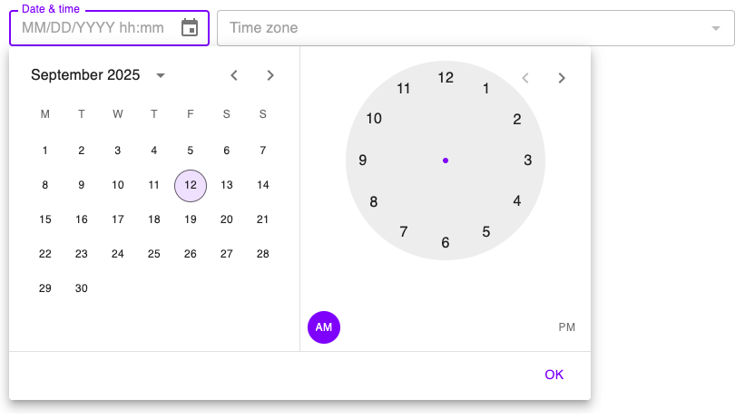
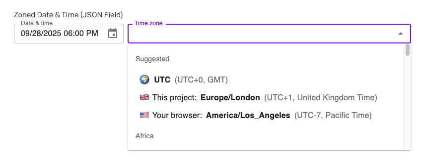
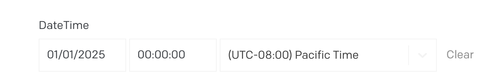
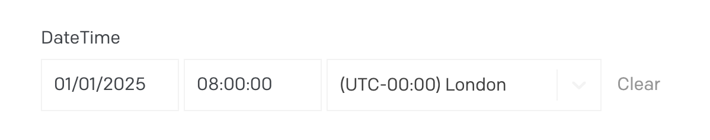
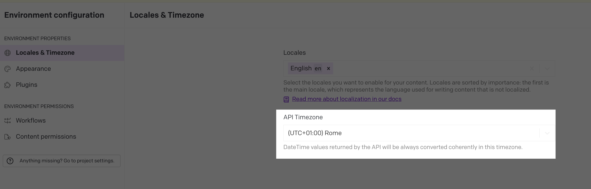
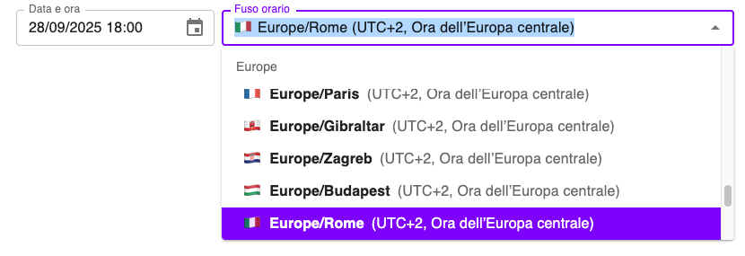

# Zoned DateTime Picker

This is a [DatoCMS](https://www.datocms.com/) field editor plugin for storing zoned datetime information in a JSON field. It provides a GUI for picking a date, time, and IANA timezone, then stores a JSON object that includes an [ISO 8601](https://developer.mozilla.org/en-US/docs/Web/JavaScript/Reference/Global_Objects/Date/toISOString) datetime string, a [RFC 9557/IXDTF](https://datatracker.ietf.org/doc/rfc9557/) _zoned_ datetime string, a UNIX timestamp, and other helpful fields.

## Screenshots

Date & time picker


Time zone picker (uses [IANA TZ strings](https://data.iana.org/time-zones/tzdb/zone1970.tab))


## JSON Shape

Once you select a date, time, and time zone, the plugin stores an object like this:

```json5
{
  datetime_iso8601: "1996-12-19T16:39:57-08:00", // ISO8601 string
  zone: "America/Los_Angeles", // IANA TZ identifier
  offset: "-08:00", // Offset from UTC, same as ISO8601
  date: "1996-12-19", // ISO date
  time_24hr: "16:39:57", // 24-hour time
  time_12hr: "04:39:57", // 12-hour time
  am_pm: "pm", // AM/PM for 12-hour time
  timestamp_epoch_seconds: "851042397", // Unix epoch timestamp
  zoned_datetime_ixdtf: "1996-12-19T16:39:57-08:00[America/Los_Angeles]", // For future use with Temporal API; see RFC 9557
}
```
## How to use
This is a field editor that can override any JSON field in your project.

- Install the plugin to your project
- In your schema, navigate to the JSON field you wish to edit
- Go to its "Presentation" tab
- Under the "Field editor" section, choose Zoned DateTime Picker
- Save the field
- Return to content editing. The plugin should replace the raw JSON field.

## Why would I use this? Why not use the built-in date & time field?

When you enter a datetime into DatoCMS's default datetime picker, we **do not actually save the time zone or offset you originally selected**. Instead, two implicit conversions happen:

1) In the UI, you'll see the selected time displayed in the time zone configured in your personal Editor Preferences. Editors in different time zones will thus see different values.
2) In the APIs (either the CMA or CDA), we will instead return the time zone configured in your Environment Configuration. This is not affected by any editor's personal UI preferences.

As an example:
* In the date picker field, you initially enter `2025-01-01T00:00:00-08:00` in US Pacific time and click save:
  

* When you next refresh the record, it will instead show in your editor's configured UI time zone, like  `2025-01-01T08:00:00Z` in London time/UTC:
  

* Then if you request it via an API, it will show a different time altogether, your **environment's** configured **API time zone**, like `2025-01-01T09:00:00+01:00` in Rome:

  
* The original time zone and offset (Pacific Time or -08:00) are **lost forever**. In every case, the underlying timestamp is still the same, but the time zone and offsets are impliclity converted to either the UI or API setting. Without this plugin, there is no way to recover the original time zone.

This generally isn't a problem if you only operate in one time zone. But it matters for some use cases:

1. It makes cross-time-zone marketing difficult. It unrecoverably loses the original offset (`-08:00`). If your event was in `America/Los_Angeles`, your website was in `Europe/Rome`, and your visitor was in `Europe/London` , your frontend would have no way to know which time zone to use.

2. It doesn't respect daylight savings time. With an ISO 8601 offset like `-06:00`, there is no way to know if that is being used for a region that observes daylight savings time (like CDT, Central Daylight Time, in the USA) or one that doesn't (like Mexico City, which uses CST, Central Standard Time, instead). Going from a IANA time zone string like `America/Chicago` to an offset like `-06:00` is a **one-way, lossy operation**. You **cannot go back** from `-06:00` to a time zone string, because you don't know if it was originally `America/Chicago` (which is usually `-06:00` but is `-05:00` in the summer and autumn due to DST) or `America/Mexico_City` (which is always `-06:00`). 

The plugin does two things to address this situation:

1. It remembers the original offset you chose. If you entered the time in `-08:00`, it stays that way and does not get coerced to any other offset.
2. It adds an explicit IANA time zone string like `America/Los_Angeles`. Your frontend can then use that time zone to ensure proper display via [`Intl.DateTimeFormat()`](https://developer.mozilla.org/en-US/docs/Web/JavaScript/Reference/Global_Objects/Intl/DateTimeFormat) or a helper library like [Luxon](https://moment.github.io/luxon/#/).

This information is available in several formats in the JSON output (see [JSON Shape](#json-shape) above).

## Supported localizations



The plugin supports localized datetime entry and time zone names in the following languages (same as in DatoCMS itself):

- English (en)
- Italian (it)
- German (de)
- French (fr)
- Spanish (es)
- Czech (cs)
- Dutch (nl)
- Portuguese (pt)

## Changelog

- 0.1.5 - Minor package updates and readme clarifications
- 0.1.4 - Minor bug fixes
- 0.1.2 - Initial release

## Attributions

This plugin was made with:

- [MUI-X](https://mui.com/x/react-date-pickers/date-time-picker/) React UI components
- [Luxon](https://moment.github.io/luxon/#/) DateTime library
- [IANA Time Zone Database](https://www.iana.org/time-zones)
- [OpenAI Codex](https://openai.com/codex/)